project3
================
Xiaomeng Liu
2023-11-05

- [library](#library)
- [Introduction section](#introduction-section)
- [Data](#data)
  - [Read in the data](#read-in-the-data)
  - [Combine 1 and 2 Education
    levels](#combine-1-and-2-education-levels)
  - [Convert variables to factors](#convert-variables-to-factors)
- [Summarizations](#summarizations)
- [Modeling](#modeling)
  - [Data cleaning](#data-cleaning)
  - [train and test set](#train-and-test-set)
  - [what log loss is:](#what-log-loss-is)
  - [First method: logistic
    regression](#first-method-logistic-regression)
  - [Second method: Lasso logistic](#second-method-lasso-logistic)
  - [Third method: Classification
    tree](#third-method-classification-tree)
  - [Fourth method: Random forest](#fourth-method-random-forest)
  - [Fifth method: loess method](#fifth-method-loess-method)
  - [Sixth method: Bayesian Generalized Linear
    Model](#sixth-method-bayesian-generalized-linear-model)
- [Final Model Selection](#final-model-selection)

# library

All the libraries used in this file are included here.

``` r
library(readr)
library(dplyr)
library(ggplot2)
library(corrplot)
library(caret)
library(ModelMetrics)
```

# Introduction section

``` r
  #per https://www.cdc.gov/brfss/annual_data/2015/pdf/codebook15_llcp.pdf,
  #here are value meanings for the education variable:
    #1 = Never attended school or only kindergarten 
    #2 = Grades 1 through 8 (Elementary)
    #3 = Grades 9 through 11 (Some high school)
    #4 = Grade 12 or GED (High school graduate) 
    #5 = College 1 year to 3 years (Some college or technical school)
    #6 = College 4 years or more (College graduate)
    #9 = Refused

#and here are values for other non-binary variables:
  #income
    #1 = Less than $10,000
    #2 = Less than $15,000 ($10,000 to less than $15,000)
    #3 = Less than $20,000 ($15,000 to less than $20,000)
    #4 = Less than $25,000 ($20,000 to less than $25,000)
    #5 = Less than $35,000 ($25,000 to less than $35,000)
    #6 = Less than $50,000 ($35,000 to less than $50,000)
    #7 = Less than $75,000 ($50,000 to less than $75,000)
    #8 = $75,000 or more
    #77 = Don’t know/Not sure
    #99 = Refused

  #Age
    #1 = Age 18 to 24
    #2 = Age 25 to 29
    #3 = Age 30 to 34
    #4 = Age 35 to 39
    #5 = Age 40 to 44
    #6 = Age 45 to 49
    #7 = Age 50 to 54
    #8 = Age 55 to 59
    #9 = Age 60 to 64
    #10 = Age 65 to 69
    #11 = Age 70 to 74
    #12 = Age 75 to 79
    #13 = Age 80 or older
    #14 = Don’t know/Refused/Missing

  #GenHlth
    #1 = excellent 
    #2 = very good 
    #3 = good 
    #4 = fair 
    #5 = poor 

  #Sex is coded as 0 = female, 1 = male
```

# Data

### Read in the data

``` r
#read in csv file
diabetes<-read.csv("diabetes_binary_health_indicators_BRFSS2015.csv")
```

### Combine 1 and 2 Education levels

``` r
#create collapsed version of education variable
diabetes$Education <- recode(diabetes$Education, `1` = 2)
table(diabetes$Education)
```

    ## 
    ##      2      3      4      5      6 
    ##   4217   9478  62750  69910 107325

### Convert variables to factors

``` r
#create factor version of variables, where applicable
#in order to facilitate the EDA, for now at least, we'll retain both the factor version and the numeric version of each variable (we may need to drop one version, though, before running models)
diabetes$Diabetes_binary_f   <- as.factor(diabetes$Diabetes_binary)
diabetes$HighBP_f    <- as.factor(diabetes$HighBP)
diabetes$HighChol_f  <- as.factor(diabetes$HighChol)
diabetes$CholCheck_f     <- as.factor(diabetes$CholCheck)
#BMI -- this is a continuous var
diabetes$Smoker_f    <- as.factor(diabetes$Smoker)
diabetes$Stroke_f    <- as.factor(diabetes$Stroke)
diabetes$HeartDiseaseorAttack_f  <- as.factor(diabetes$HeartDiseaseorAttack)
diabetes$PhysActivity_f  <- as.factor(diabetes$PhysActivity)
diabetes$Fruits_f    <- as.factor(diabetes$Fruits)
diabetes$Veggies_f   <- as.factor(diabetes$Veggies)
diabetes$HvyAlcoholConsump_f     <- as.factor(diabetes$HvyAlcoholConsump)
diabetes$AnyHealthcare_f     <- as.factor(diabetes$AnyHealthcare)
diabetes$NoDocbcCost_f   <- as.factor(diabetes$NoDocbcCost)
diabetes$GenHlth_f <-  as.factor(diabetes$GenHlth)
#MentHlth -- this is a continuous var
#PhysHlth -- this is a continuous var
diabetes$DiffWalk_f  <- as.factor(diabetes$DiffWalk)
diabetes$Sex_f   <- as.factor(diabetes$Sex)
diabetes$Age_f   <- as.factor(diabetes$Age)
diabetes$Education_f     <- as.factor(diabetes$Education)
diabetes$Income_f    <- as.factor(diabetes$Income)


#subset to specific level of education per *params* setting
temp <- subset(diabetes, Education==params$ed_level)
```

# Summarizations

``` r
#confirm that we're working with the desired set of cases
table(temp$Education, temp$Education_f)
```

    ##    
    ##        2    3    4    5    6
    ##   2 4217    0    0    0    0

``` r
ggplot(data=temp, aes(x=Education_f)) + 
  geom_dotplot(binwidth = .05, method = "histodot") + 
  labs(title = "confirm that we're working with the desired set of cases")
```

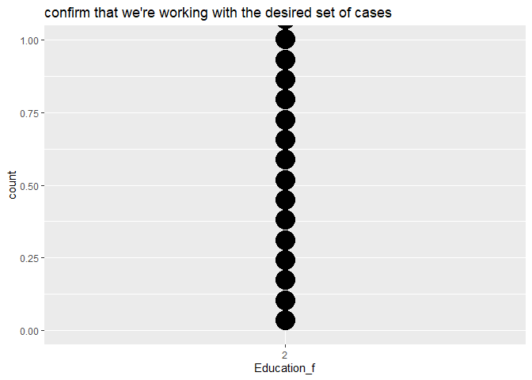<!-- -->

``` r
#function to check prevalence of diabetes at each level of each factor, and generate corresponding plots
#(I still need to flesh out this function such that it labels the plots)
explore <- function(by_var)
{
results1 <- temp %>%
  group_by({{by_var}}) %>%
  summarize(diabetes_rate = mean(Diabetes_binary))
    #passing variable names to function using curly brackets:
    #https://stackoverflow.com/questions/63433728/how-do-i-pass-a-variable-name-to-an-argument-in-a-function
print(results1)

results2 <- ggplot(data=temp, aes(x={{by_var}}, fill=Diabetes_binary_f)) + 
  geom_bar(stat="count")
print(results2)
}

#probably need to run the above function for at least the sex, age, and income variables, but may not need to run it for this entire list
explore(by_var = HighBP_f)
```

    ## # A tibble: 2 × 2
    ##   HighBP_f diabetes_rate
    ##   <fct>            <dbl>
    ## 1 0                0.154
    ## 2 1                0.388

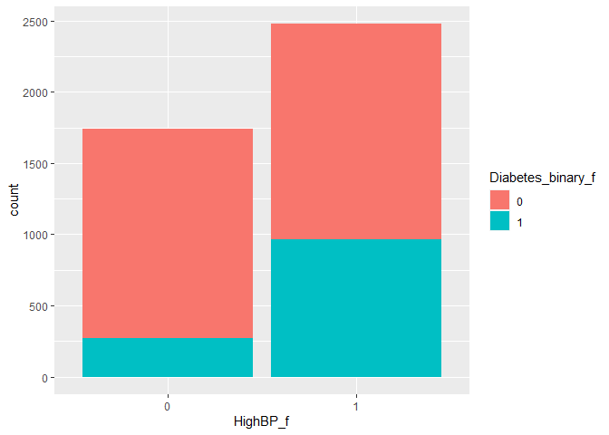<!-- -->

``` r
explore(by_var = HighChol_f)
```

    ## # A tibble: 2 × 2
    ##   HighChol_f diabetes_rate
    ##   <fct>              <dbl>
    ## 1 0                  0.180
    ## 2 1                  0.389

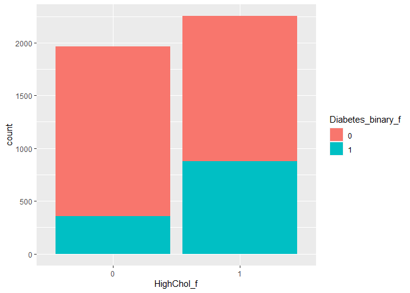<!-- -->

``` r
explore(by_var = CholCheck_f)
```

    ## # A tibble: 2 × 2
    ##   CholCheck_f diabetes_rate
    ##   <fct>               <dbl>
    ## 1 0                  0.0672
    ## 2 1                  0.298

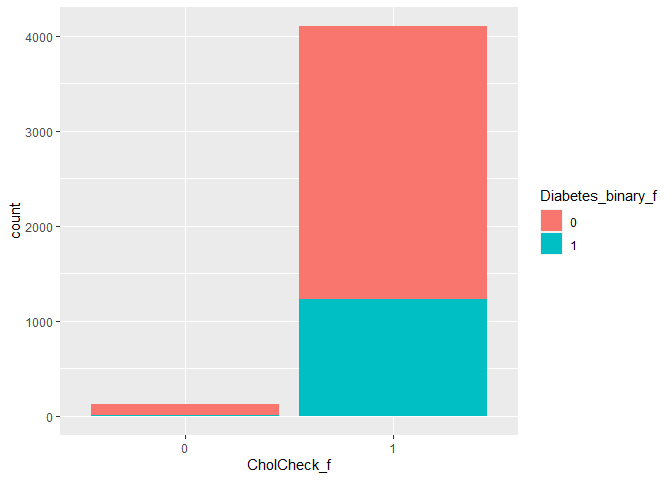<!-- -->

``` r
explore(by_var = Smoker_f)
```

    ## # A tibble: 2 × 2
    ##   Smoker_f diabetes_rate
    ##   <fct>            <dbl>
    ## 1 0                0.281
    ## 2 1                0.303

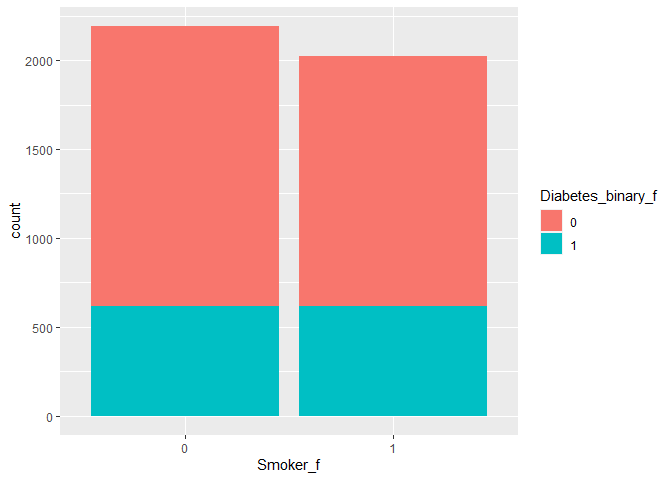<!-- -->

``` r
explore(by_var = Stroke_f)
```

    ## # A tibble: 2 × 2
    ##   Stroke_f diabetes_rate
    ##   <fct>            <dbl>
    ## 1 0                0.280
    ## 2 1                0.417

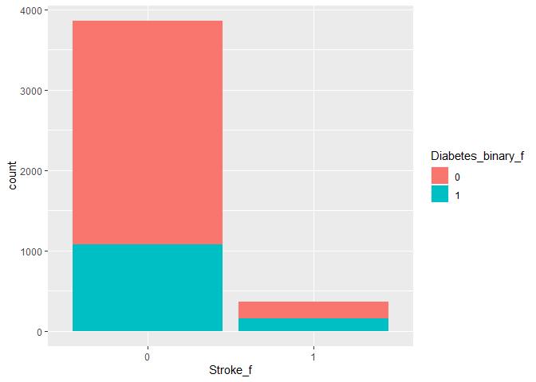<!-- -->

``` r
explore(by_var = HeartDiseaseorAttack_f)
```

    ## # A tibble: 2 × 2
    ##   HeartDiseaseorAttack_f diabetes_rate
    ##   <fct>                          <dbl>
    ## 1 0                              0.250
    ## 2 1                              0.467

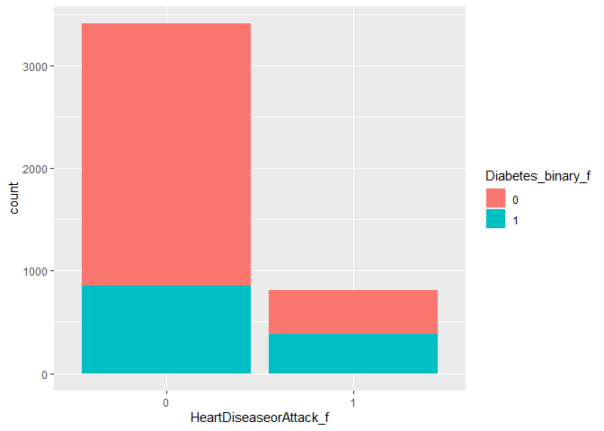<!-- -->

``` r
explore(by_var = PhysActivity_f)
```

    ## # A tibble: 2 × 2
    ##   PhysActivity_f diabetes_rate
    ##   <fct>                  <dbl>
    ## 1 0                      0.325
    ## 2 1                      0.267

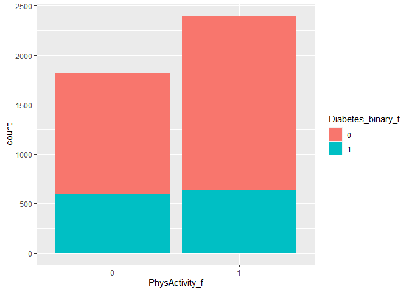<!-- -->

``` r
explore(by_var = Fruits_f)
```

    ## # A tibble: 2 × 2
    ##   Fruits_f diabetes_rate
    ##   <fct>            <dbl>
    ## 1 0                0.301
    ## 2 1                0.285

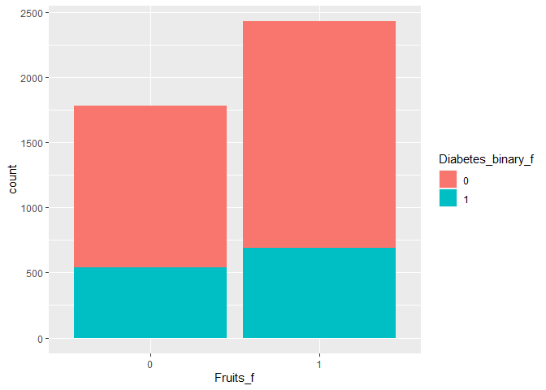<!-- -->

``` r
explore(by_var = Veggies_f)
```

    ## # A tibble: 2 × 2
    ##   Veggies_f diabetes_rate
    ##   <fct>             <dbl>
    ## 1 0                 0.314
    ## 2 1                 0.282

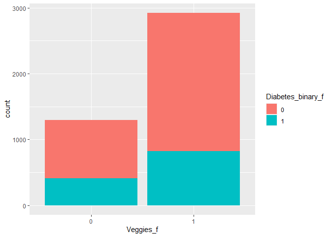<!-- -->

``` r
explore(by_var = HvyAlcoholConsump_f)
```

    ## # A tibble: 2 × 2
    ##   HvyAlcoholConsump_f diabetes_rate
    ##   <fct>                       <dbl>
    ## 1 0                           0.296
    ## 2 1                           0.116

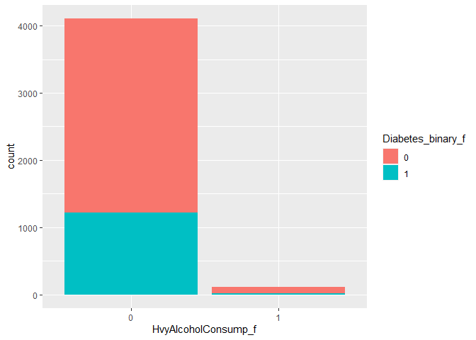<!-- -->

``` r
explore(by_var = AnyHealthcare_f)
```

    ## # A tibble: 2 × 2
    ##   AnyHealthcare_f diabetes_rate
    ##   <fct>                   <dbl>
    ## 1 0                       0.188
    ## 2 1                       0.311

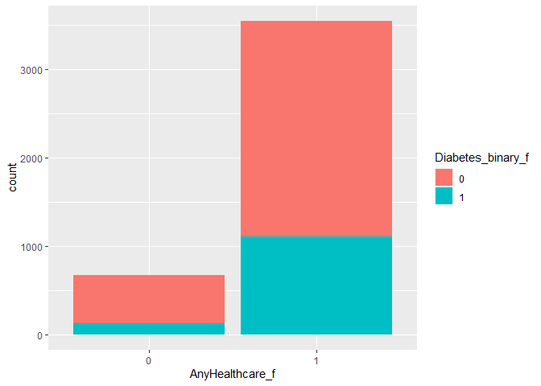<!-- -->

``` r
explore(by_var = NoDocbcCost_f)
```

    ## # A tibble: 2 × 2
    ##   NoDocbcCost_f diabetes_rate
    ##   <fct>                 <dbl>
    ## 1 0                     0.292
    ## 2 1                     0.292

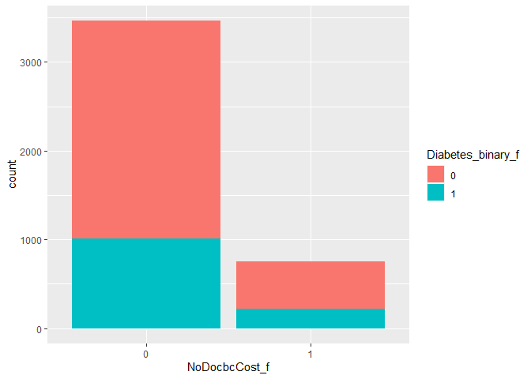<!-- -->

``` r
explore(by_var = GenHlth_f)
```

    ## # A tibble: 5 × 2
    ##   GenHlth_f diabetes_rate
    ##   <fct>             <dbl>
    ## 1 1                 0.116
    ## 2 2                 0.134
    ## 3 3                 0.202
    ## 4 4                 0.356
    ## 5 5                 0.474

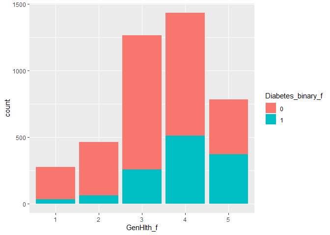<!-- -->

``` r
explore(by_var = DiffWalk_f)
```

    ## # A tibble: 2 × 2
    ##   DiffWalk_f diabetes_rate
    ##   <fct>              <dbl>
    ## 1 0                  0.220
    ## 2 1                  0.409

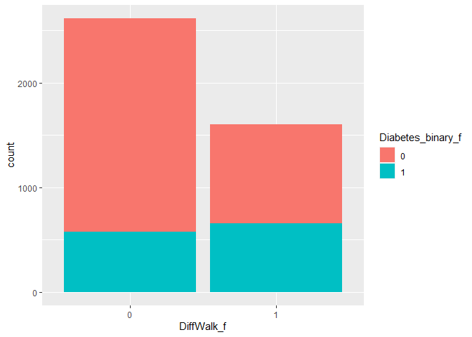<!-- -->

``` r
explore(by_var = Sex_f)
```

    ## # A tibble: 2 × 2
    ##   Sex_f diabetes_rate
    ##   <fct>         <dbl>
    ## 1 0             0.310
    ## 2 1             0.270

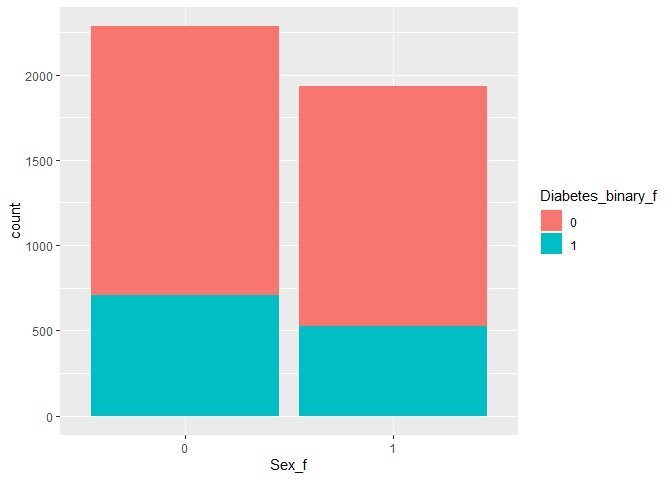<!-- -->

``` r
explore(by_var = Age_f)
```

    ## # A tibble: 13 × 2
    ##    Age_f diabetes_rate
    ##    <fct>         <dbl>
    ##  1 1            0.0385
    ##  2 2            0.0769
    ##  3 3            0.0796
    ##  4 4            0.0819
    ##  5 5            0.0950
    ##  6 6            0.240 
    ##  7 7            0.216 
    ##  8 8            0.319 
    ##  9 9            0.359 
    ## 10 10           0.388 
    ## 11 11           0.380 
    ## 12 12           0.361 
    ## 13 13           0.287

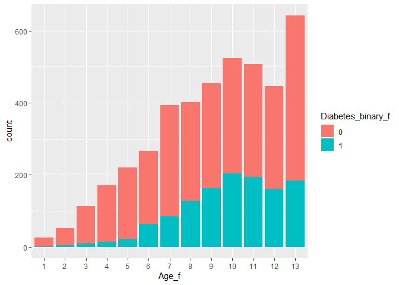<!-- -->

``` r
explore(by_var = Income_f)
```

    ## # A tibble: 8 × 2
    ##   Income_f diabetes_rate
    ##   <fct>            <dbl>
    ## 1 1                0.372
    ## 2 2                0.363
    ## 3 3                0.281
    ## 4 4                0.241
    ## 5 5                0.254
    ## 6 6                0.190
    ## 7 7                0.166
    ## 8 8                0.161

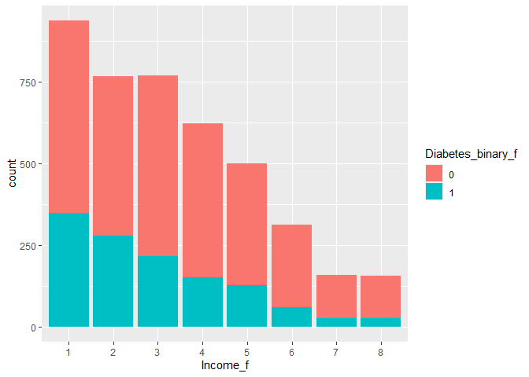<!-- -->

``` r
#correlation matrix (outcome var x continuous vars)
corr_vars <-
  temp %>% select(c(Diabetes_binary, BMI, MentHlth, PhysHlth))
correlation <- cor(corr_vars, method = "spearman")
corrplot(correlation, type = "upper", tl.pos = "lt")
corrplot(correlation, type = "lower", method = "number", add = TRUE, diag = FALSE, tl.pos = "n")
```

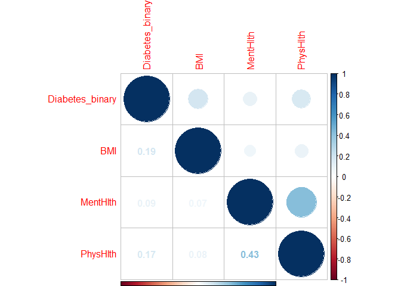<!-- -->

``` r
#density plots / boxplots (outcome var x continuous vars)
#I'm guessing we could just choose one or the other
ggplot(data=temp, aes(x=BMI, fill=Diabetes_binary_f)) + 
  geom_density(adjust = 0.5, alpha = 0.5)
```

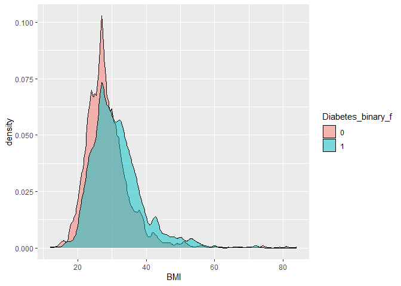<!-- -->

``` r
ggplot(data=temp, aes(x=Diabetes_binary_f, y=BMI)) + geom_boxplot()
```

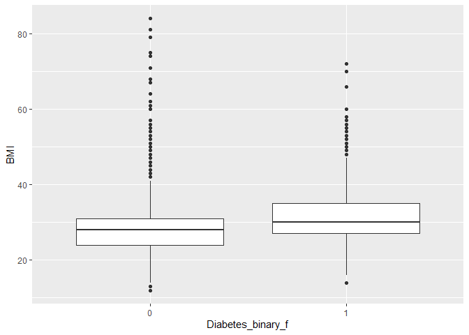<!-- -->

``` r
ggplot(data=temp, aes(x=MentHlth, fill=Diabetes_binary_f)) + 
  geom_density(adjust = 0.5, alpha = 0.5)
```

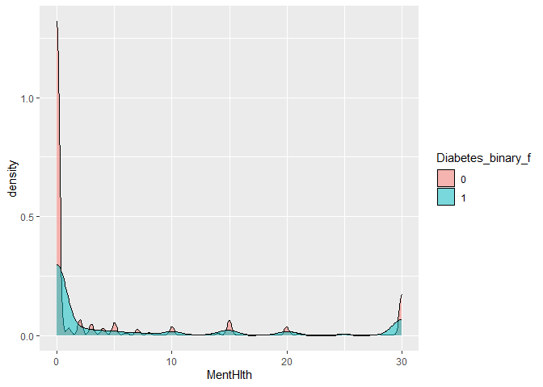<!-- -->

``` r
ggplot(data=temp, aes(x=Diabetes_binary_f, y=MentHlth)) + geom_boxplot()
```

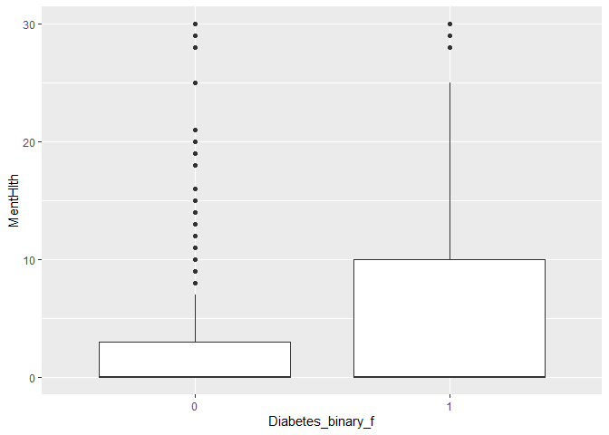<!-- -->

``` r
ggplot(data=temp, aes(x=PhysHlth, fill=Diabetes_binary_f)) + 
  geom_density(adjust = 0.5, alpha = 0.5)
```

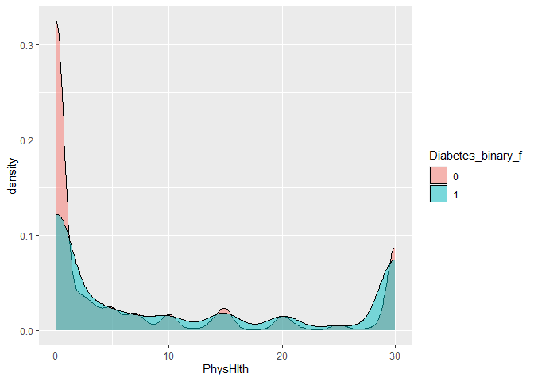<!-- -->

``` r
bp3 <- ggplot(data=temp, aes(x=Diabetes_binary_f, y=PhysHlth)) + geom_boxplot()
```

# Modeling

## Data cleaning

``` r
#prior to running models, in instances where we have both a factor and a non-factor version of a given variable, we need to first drop the non-factor version of the variable
#we also need to drop both versions of the education variable (since it will not vary given that we've subset our data to a specific education level)
temp$Diabetes_binary     <- NULL 
temp$HighBP  <- NULL
temp$HighChol    <- NULL
temp$CholCheck   <- NULL
temp$Smoker  <- NULL
temp$Stroke  <- NULL
temp$HeartDiseaseorAttack    <- NULL
temp$PhysActivity    <- NULL
temp$Fruits  <- NULL
temp$Veggies     <- NULL
temp$HvyAlcoholConsump   <- NULL
temp$AnyHealthcare   <- NULL
temp$NoDocbcCost     <- NULL 
temp$GenHlth <-  NULL
temp$DiffWalk    <- NULL
temp$Sex     <- NULL
temp$Age     <- NULL
temp$Education   <- NULL
temp$Education_f     <- NULL
temp$Income  <- NULL

temp$Diabetes_binary_f<-ifelse(temp$Diabetes_binary_f==0,"no","yes")
temp$Diabetes_binary_f<-as.factor(temp$Diabetes_binary_f)
```

## train and test set

``` r
# set the seed
set.seed(433)
# split the training and testing
indextrain<-createDataPartition(y=temp$Diabetes_binary,p=0.7,list=FALSE)
ed_train<-temp[indextrain,]
ed_test<-temp[-indextrain,]
```

## what log loss is:

Log loss is a common evaluation metric for binary classification models.
It measure the performance of a model by quantifying the difference
between predicted probabilities and actual values. We prefer it because
log loss penalizes confident and incorrect predictors more heavily.It
also provides a continuous and differentiable meausre of the model’s
performance, making it suitable of optimization algorithms.

## First method: logistic regression

\###explanation of what a logistic regression is

The logistic regression is modeling average number of successes for a
given x, i.e. probability of success.Basic logistic regression models
success probability using the logistic function
$P(success|yard)=\frac{e^{\beta_0+\beta_1x}}{1+e^{\beta_0+\beta_1x}}$

\###why we apply it to this kind of data We have a response variable
that is success/failure and it is perfect for fitting a logistic
regression mode.

\###fit three candidate logistic regression models and choose the best
model.

``` r
ed_logistic1<-train(Diabetes_binary_f~BMI+HighChol_f+HighBP_f,data=ed_train,
             method="glm", 
             metric="logLoss",
             trControl=trainControl(method = "cv",number = 5,classProbs = TRUE, summaryFunction = mnLogLoss),
             preProcess=c("center","scale")
)
ed_logistic1
```

    ## Generalized Linear Model 
    ## 
    ## 2952 samples
    ##    3 predictor
    ##    2 classes: 'no', 'yes' 
    ## 
    ## Pre-processing: centered (3), scaled (3) 
    ## Resampling: Cross-Validated (5 fold) 
    ## Summary of sample sizes: 2361, 2362, 2361, 2362, 2362 
    ## Resampling results:
    ## 
    ##   logLoss  
    ##   0.5489609

``` r
ed_logistic2<-train(Diabetes_binary_f~BMI+HighChol_f+HighBP_f+MentHlth+PhysActivity_f,data=ed_train,
             method="glm", 
             metric="logLoss",
             trControl=trainControl(method = "cv",number = 5,classProbs = TRUE, summaryFunction = mnLogLoss),
             preProcess=c("center","scale")
)
ed_logistic2
```

    ## Generalized Linear Model 
    ## 
    ## 2952 samples
    ##    5 predictor
    ##    2 classes: 'no', 'yes' 
    ## 
    ## Pre-processing: centered (5), scaled (5) 
    ## Resampling: Cross-Validated (5 fold) 
    ## Summary of sample sizes: 2361, 2361, 2362, 2362, 2362 
    ## Resampling results:
    ## 
    ##   logLoss  
    ##   0.5475253

``` r
ed_logistic3<-train(Diabetes_binary_f~.,data=ed_train,
             method="glm", 
             metric="logLoss",
             trControl=trainControl(method = "cv",number = 5,classProbs = TRUE, summaryFunction = mnLogLoss),
             preProcess=c("center","scale")
)
ed_logistic3
```

    ## Generalized Linear Model 
    ## 
    ## 2952 samples
    ##   20 predictor
    ##    2 classes: 'no', 'yes' 
    ## 
    ## Pre-processing: centered (40), scaled (40) 
    ## Resampling: Cross-Validated (5 fold) 
    ## Summary of sample sizes: 2362, 2362, 2362, 2360, 2362 
    ## Resampling results:
    ## 
    ##   logLoss 
    ##   0.511538

``` r
# return the result
paste0("According to the results, the lowest logLoss is the model ", c("1","2","3")[which.min(c(ed_logistic1$results[2],ed_logistic2$results[2],ed_logistic3$results[2]))])
```

    ## [1] "According to the results, the lowest logLoss is the model 3"

## Second method: Lasso logistic

Lasso models aim to leverage the bias-variance trade-off by purposefully
introducing small amounts of bias while training the model, with the
hope of ultimately decreasing variance (and thereby improving
performance when using the model on test data). PROBABLY NEED TO SAY
MORE HERE (this might help:
<https://www.statology.org/lasso-regression/>)

``` r
ed_lasso <- train(Diabetes_binary_f ~ ., data = ed_train,
  method = "glmnet",
  metric="logLoss",
  preProcess = c("center", "scale"),
  trControl = trainControl(method = "cv", number = 5, 
                           classProbs = TRUE, summaryFunction = mnLogLoss),
  tuneGrid = expand.grid(alpha = 1, lambda = seq(0, 1, by = 0.1)))

ed_lasso
```

    ## glmnet 
    ## 
    ## 2952 samples
    ##   20 predictor
    ##    2 classes: 'no', 'yes' 
    ## 
    ## Pre-processing: centered (40), scaled (40) 
    ## Resampling: Cross-Validated (5 fold) 
    ## Summary of sample sizes: 2361, 2361, 2362, 2362, 2362 
    ## Resampling results across tuning parameters:
    ## 
    ##   lambda  logLoss  
    ##   0.0     0.5149821
    ##   0.1     0.5965355
    ##   0.2     0.6036376
    ##   0.3     0.6036376
    ##   0.4     0.6036376
    ##   0.5     0.6036376
    ##   0.6     0.6036376
    ##   0.7     0.6036376
    ##   0.8     0.6036376
    ##   0.9     0.6036376
    ##   1.0     0.6036376
    ## 
    ## Tuning parameter 'alpha' was held constant at a value of 1
    ## logLoss was used to select the optimal model using the smallest value.
    ## The final values used for the model were alpha = 1 and lambda = 0.

## Third method: Classification tree

Next we predict the presence of diabetes using a classification tree, in
which the predictor space is divided into various “regions”, and the
predicted value for any given observation is the most common
classification among all other observations in that region. Here we
train our model using 5-fold cross-validation as well as different
tuning parameters to find the optimal number and types of tree splits.
PROBABLY NEED TO SAY MORE HERE

``` r
#classification tree
ed_ct <- train(Diabetes_binary_f ~ ., data = ed_train,
  method = "rpart",
  metric="logLoss",
  preProcess = c("center", "scale"),
  trControl = trainControl(method = "cv", number = 5, 
                           classProbs = TRUE, summaryFunction = mnLogLoss),
  tuneGrid = data.frame(cp = seq(from = .001, to = .1, by = .001)))

ed_ct
```

    ## CART 
    ## 
    ## 2952 samples
    ##   20 predictor
    ##    2 classes: 'no', 'yes' 
    ## 
    ## Pre-processing: centered (40), scaled (40) 
    ## Resampling: Cross-Validated (5 fold) 
    ## Summary of sample sizes: 2362, 2361, 2362, 2362, 2361 
    ## Resampling results across tuning parameters:
    ## 
    ##   cp     logLoss  
    ##   0.001  0.7857631
    ##   0.002  0.6967020
    ##   0.003  0.6296692
    ##   0.004  0.6058480
    ##   0.005  0.6037368
    ##   0.006  0.5910199
    ##   0.007  0.5910199
    ##   0.008  0.5890644
    ##   0.009  0.5886371
    ##   0.010  0.5886371
    ##   0.011  0.5881956
    ##   0.012  0.5669055
    ##   0.013  0.5737232
    ##   0.014  0.5754912
    ##   0.015  0.5848700
    ##   0.016  0.5856412
    ##   0.017  0.5856412
    ##   0.018  0.5852882
    ##   0.019  0.5862269
    ##   0.020  0.5862269
    ##   0.021  0.6015025
    ##   0.022  0.6015025
    ##   0.023  0.6015025
    ##   0.024  0.6015025
    ##   0.025  0.6015025
    ##   0.026  0.6015025
    ##   0.027  0.6015025
    ##   0.028  0.6015025
    ##   0.029  0.6015025
    ##   0.030  0.6015025
    ##   0.031  0.6015025
    ##   0.032  0.6036376
    ##   0.033  0.6036376
    ##   0.034  0.6036376
    ##   0.035  0.6036376
    ##   0.036  0.6036376
    ##   0.037  0.6036376
    ##   0.038  0.6036376
    ##   0.039  0.6036376
    ##   0.040  0.6036376
    ##   0.041  0.6036376
    ##   0.042  0.6036376
    ##   0.043  0.6036376
    ##   0.044  0.6036376
    ##   0.045  0.6036376
    ##   0.046  0.6036376
    ##   0.047  0.6036376
    ##   0.048  0.6036376
    ##   0.049  0.6036376
    ##   0.050  0.6036376
    ##   0.051  0.6036376
    ##   0.052  0.6036376
    ##   0.053  0.6036376
    ##   0.054  0.6036376
    ##   0.055  0.6036376
    ##   0.056  0.6036376
    ##   0.057  0.6036376
    ##   0.058  0.6036376
    ##   0.059  0.6036376
    ##   0.060  0.6036376
    ##   0.061  0.6036376
    ##   0.062  0.6036376
    ##   0.063  0.6036376
    ##   0.064  0.6036376
    ##   0.065  0.6036376
    ##   0.066  0.6036376
    ##   0.067  0.6036376
    ##   0.068  0.6036376
    ##   0.069  0.6036376
    ##   0.070  0.6036376
    ##   0.071  0.6036376
    ##   0.072  0.6036376
    ##   0.073  0.6036376
    ##   0.074  0.6036376
    ##   0.075  0.6036376
    ##   0.076  0.6036376
    ##   0.077  0.6036376
    ##   0.078  0.6036376
    ##   0.079  0.6036376
    ##   0.080  0.6036376
    ##   0.081  0.6036376
    ##   0.082  0.6036376
    ##   0.083  0.6036376
    ##   0.084  0.6036376
    ##   0.085  0.6036376
    ##   0.086  0.6036376
    ##   0.087  0.6036376
    ##   0.088  0.6036376
    ##   0.089  0.6036376
    ##   0.090  0.6036376
    ##   0.091  0.6036376
    ##   0.092  0.6036376
    ##   0.093  0.6036376
    ##   0.094  0.6036376
    ##   0.095  0.6036376
    ##   0.096  0.6036376
    ##   0.097  0.6036376
    ##   0.098  0.6036376
    ##   0.099  0.6036376
    ##   0.100  0.6036376
    ## 
    ## logLoss was used to select the optimal model using the smallest value.
    ## The final value used for the model was cp = 0.012.

## Fourth method: Random forest

\###Explanation of the random forest: The random forest uses the same
idea as bagging. It creates multiple trees from bootstrap samples and
averages results. It uses a random subset of predictors for each
bootstrap sample fit.

\###why we might use it instead of a basic classification tree: We want
to use random forest because we do not want to use all the predictors.If
a really strong predictor exists, every bootstrap tree will probably use
it for the first split and it will make the prediction more correlated.

``` r
ed_rf<-train(Diabetes_binary_f~.,#BMI+HighBP_f+HighChol_f
             data=ed_train,
             method="rf", 
             metric="logLoss",
             trControl=trainControl(method = "cv",number = 5, classProbs=TRUE, summaryFunction=mnLogLoss),
             preProcess=c("center","scale"),
             tuneGrid=data.frame(mtry=c(5:7))
)
ed_rf
```

## Fifth method: loess method

new method by Erich

``` r
ed_loess <- train(Diabetes_binary_f ~ ., data = ed_train,
  method = "gamLoess",
  metric="logLoss",
  preProcess = c("center", "scale"),
  trControl = trainControl(method = "cv", number = 5, 
                           classProbs = TRUE, summaryFunction = mnLogLoss),
  tuneGrid = expand.grid(span = seq(0.5, 0.9, len = 5), degree = 1))
#tuning parameters as currently shown are borrowed from https://www.statology.org/loess-regression-in-r/

ed_loess
```

## Sixth method: Bayesian Generalized Linear Model

``` r
ed_bglm<-train(Diabetes_binary_f~.,data=ed_train,
             method="bayesglm", 
             metric="logLoss",
             trControl=trainControl(method = "cv",number = 5, classProbs=TRUE, summaryFunction=mnLogLoss),
             preProcess=c("center","scale")
)
ed_bglm
```

    ## Bayesian Generalized Linear Model 
    ## 
    ## 2952 samples
    ##   20 predictor
    ##    2 classes: 'no', 'yes' 
    ## 
    ## Pre-processing: centered (40), scaled (40) 
    ## Resampling: Cross-Validated (5 fold) 
    ## Summary of sample sizes: 2361, 2361, 2362, 2362, 2362 
    ## Resampling results:
    ## 
    ##   logLoss  
    ##   0.5156043

# Final Model Selection

You should now have six best models (one for each model type above)

``` r
# Method 1
a<-c("1","2","3")[which.min(c(ed_logistic1$results[2],ed_logistic2$results[2],ed_logistic3$results[2]))]
ifelse(a!=3,
       ifelse(a==1,
              CM1<-confusionMatrix(data = ed_test$Diabetes_binary_f,predict(ed_logistic1,newdata = ed_test)),
              CM1<-confusionMatrix(data = ed_test$Diabetes_binary_f,predict(ed_logistic2,newdata = ed_test))
              ),
       CM1<-confusionMatrix(data = ed_test$Diabetes_binary_f,predict(ed_logistic3,newdata = ed_test))
  )
(CM1<-CM1$overall[1])
# Method 2
CM2<-confusionMatrix(data = ed_test$Diabetes_binary_f,predict(ed_lasso,newdata = ed_test))
# Method 3
CM3<-confusionMatrix(data = ed_test$Diabetes_binary_f,predict(ed_ct,newdata = ed_test))
# Method 4
CM4<-confusionMatrix(data = ed_test$Diabetes_binary_f,predict(ed_rf,newdata = ed_test))
(CM<-CM4$overall[1])
# Method 5
CM5<-confusionMatrix(data = ed_test$Diabetes_binary_f,predict(ed_loess,newdata = ed_test))
# Method 6
CM6<-confusionMatrix(data = ed_test$Diabetes_binary_f,predict(ed_bglm,newdata = ed_test))
(CM6<-CM6$overall[1])

CM<-c(CM1,CM2,CM3,CM4,CM5,CM6)
paste0("mode",c("1","2","3","4","5","6")[which.max(CM)]," is the best model")
```

``` r
choose <- function(in_model)
{
pred <- predict(in_model, ed_test)
pred <- ifelse(pred=="no",0,1)
#as.data.frame is used here to avoid error as illustrated here: #https://www.statology.org/r-error-operator-is-invalid-for-atomic-vectors/
logLoss(actual = ed_test$Diabetes_binary_f, predicted = pred)
}
```

``` r
ed_test$Diabetes_binary_f<-ifelse(ed_test$Diabetes_binary_f=="no",0,1)
choose(in_model = ed_logistic1)
```

    ## [1] 9.911162
