    toc: true
    toc_depth: 3
    number_sections: false

    name<-c("grade K through 8","grade 9 through 11","a high school credential","some college or technical school","bachelors degree or higher")
    paste0("This is the automated generated md file for the education level ",params$ed_level,",which means that the highest level of education is ",name[as.numeric(params$ed_level)])

    ## [1] "This is the automated generated md file for the education level 6,which means that the highest level of education is NA"

    #education level 2:  highest level of education is grade K through 8
    #education level 3:  highest level of education is grade 9 through 11
    #education level 4:  highest level of education is a high school credential
    #education level 5:  highest level of education is "some college" or technical school
    #education level 6:  highest level of education is bachelors degree or higher

# Goal

We analyzed a Diabetes Health Indicator Dataset. We were doing a
separate analysis (basic EDA and the fitting/selection of predictive
models) for each of these five Education groups using a single .Rmd
file. In the file, we had a parameter corresponding to which Education
level we were looking at and we subset the data to only use those
observations for that analysis. We created render() code similar to the
lecture to make the process of creating the five separate analysis
simple to do.

# library

All the libraries used in this file are included here.

    library(readr)
    library(dplyr)
    library(ggplot2)
    library(corrplot)
    library(caret)
    library(ModelMetrics)
    library(rotationForest)

# Introduction section

The analyses presented here are based on the Diabetes Health Indicators
Dataset, made available by kaggle.com at
<https://www.kaggle.com/datasets/alexteboul/diabetes-health-indicators-dataset/>.
The specific dataset upon which this analysis is based
(diabetes\_binary\_health\_indicators\_BRFSS2015.csv) is comprised of
approximately 250,000 records, each having a dichotomous 0/1 indication
of no diabetes vs. diabetes/pre-diabetes. In addition, the datafile
contains roughly 20 feature variables of various types, including
continuous (e.g. body mass index), categorical (e.g. education level),
and dummy indicators (e.g. whether the patient has high blood pressure).

The analytic approach taken here is to control for patients’ level of
education by conducting a separate analysis (i.e. exploratory data
analysis + predictive modelling) for each of five education levels: (1)
8th grade or lower; (2) grade 9 through 11; (3) high school credential;
(4) some college or technical school; and (5) bachelors degree or
higher. The outcome measure of interest for all analyses will be the
dichotomous diabetes indicator.

      #per https://www.cdc.gov/brfss/annual_data/2015/pdf/codebook15_llcp.pdf,
      #here are value meanings for the education variable:
        #1 = Never attended school or only kindergarten 
        #2 = Grades 1 through 8 (Elementary)
        #3 = Grades 9 through 11 (Some high school)
        #4 = Grade 12 or GED (High school graduate) 
        #5 = College 1 year to 3 years (Some college or technical school)
        #6 = College 4 years or more (College graduate)
        #9 = Refused

    #and here are values for other non-binary variables:
      #income
        #1 = Less than $10,000
        #2 = Less than $15,000 ($10,000 to less than $15,000)
        #3 = Less than $20,000 ($15,000 to less than $20,000)
        #4 = Less than $25,000 ($20,000 to less than $25,000)
        #5 = Less than $35,000 ($25,000 to less than $35,000)
        #6 = Less than $50,000 ($35,000 to less than $50,000)
        #7 = Less than $75,000 ($50,000 to less than $75,000)
        #8 = $75,000 or more
        #77 = Don’t know/Not sure
        #99 = Refused

      #Age
        #1 = Age 18 to 24
        #2 = Age 25 to 29
        #3 = Age 30 to 34
        #4 = Age 35 to 39
        #5 = Age 40 to 44
        #6 = Age 45 to 49
        #7 = Age 50 to 54
        #8 = Age 55 to 59
        #9 = Age 60 to 64
        #10 = Age 65 to 69
        #11 = Age 70 to 74
        #12 = Age 75 to 79
        #13 = Age 80 or older
        #14 = Don’t know/Refused/Missing

      #GenHlth
        #1 = excellent 
        #2 = very good 
        #3 = good 
        #4 = fair 
        #5 = poor 

      #Sex is coded as 0 = female, 1 = male

# Data

Before conducting analyses, we will read in the csv datafile, collapse
education levels of “Never attended school or only kindergarten” and
“Grades 1 through 8” into a single category, and convert categorical
variables into R factors.

### Read in the data

    #read in csv file
    diabetes<-read.csv("diabetes_binary_health_indicators_BRFSS2015.csv")

### Combine 1 and 2 Education levels

    #create collapsed version of education variable
    diabetes$Education <- recode(diabetes$Education, `1` = 2)
    table(diabetes$Education)

    ## 
    ##      2      3      4      5      6 
    ##   4217   9478  62750  69910 107325

### Convert variables to factors

    #create factor version of variables, where applicable
    #in order to facilitate the EDA, for now at least, we'll retain both the factor version and the numeric version of each variable (we may need to drop one version, though, before running models)
    diabetes$Diabetes_binary_f   <- as.factor(diabetes$Diabetes_binary)
    diabetes$HighBP_f    <- as.factor(diabetes$HighBP)
    diabetes$HighChol_f  <- as.factor(diabetes$HighChol)
    diabetes$CholCheck_f     <- as.factor(diabetes$CholCheck)
    #BMI -- this is a continuous var
    diabetes$Smoker_f    <- as.factor(diabetes$Smoker)
    diabetes$Stroke_f    <- as.factor(diabetes$Stroke)
    diabetes$HeartDiseaseorAttack_f  <- as.factor(diabetes$HeartDiseaseorAttack)
    diabetes$PhysActivity_f  <- as.factor(diabetes$PhysActivity)
    diabetes$Fruits_f    <- as.factor(diabetes$Fruits)
    diabetes$Veggies_f   <- as.factor(diabetes$Veggies)
    diabetes$HvyAlcoholConsump_f     <- as.factor(diabetes$HvyAlcoholConsump)
    diabetes$AnyHealthcare_f     <- as.factor(diabetes$AnyHealthcare)
    diabetes$NoDocbcCost_f   <- as.factor(diabetes$NoDocbcCost)
    diabetes$GenHlth_f <-  as.factor(diabetes$GenHlth)
    #MentHlth -- this is a continuous var
    #PhysHlth -- this is a continuous var
    diabetes$DiffWalk_f  <- as.factor(diabetes$DiffWalk)
    diabetes$Sex_f   <- as.factor(diabetes$Sex)
    diabetes$Age_f   <- as.factor(diabetes$Age)
    diabetes$Education_f     <- as.factor(diabetes$Education)
    diabetes$Income_f    <- as.factor(diabetes$Income)

## subset to specific level of education per *params* setting

    #subset to specific level of education per *params* setting
    temp <- subset(diabetes, Education==params$ed_level)

# Summarizations

Prior to modelling our data, we will first conduct an exploratory data
analysis (EDA). Our EDA will begin by confirming that we are working
with the desired set of cases, i.e. the set of cases corresponding to a
single level of the categorical “education” measure.

    #confirm that we're working with the desired set of cases
    table(temp$Education, temp$Education_f)

    ##    
    ##          2      3      4      5      6
    ##   6      0      0      0      0 107325

    ggplot(data=temp, aes(x=Education_f)) + 
      geom_dotplot(binwidth = .05, method = "histodot") + 
      labs(title = "confirm that we're working with the desired set of cases")

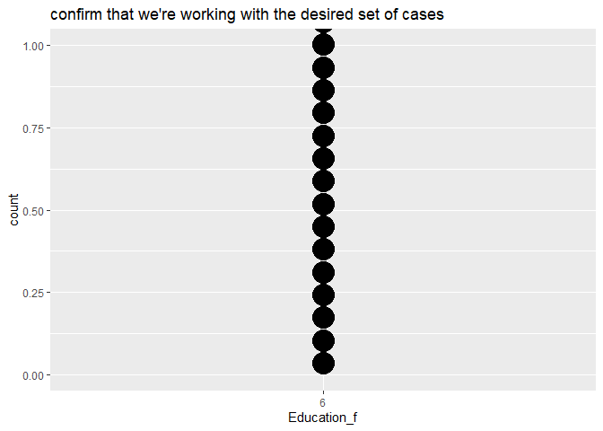 A
basic structure of the data set is shown below. Numerical summaries were
made for the numerical variables. This would help us to understand more
about the numerical variables.

    # basic structure of the data set
    str(temp)

    ## 'data.frame':    107325 obs. of  41 variables:
    ##  $ Diabetes_binary       : num  0 0 0 1 0 0 0 0 0 1 ...
    ##  $ HighBP                : num  0 1 1 0 0 1 0 0 0 1 ...
    ##  $ HighChol              : num  0 1 0 0 1 0 0 1 0 1 ...
    ##  $ CholCheck             : num  0 1 1 1 1 1 0 1 1 1 ...
    ##  $ BMI                   : num  25 25 30 25 33 33 23 28 32 37 ...
    ##  $ Smoker                : num  1 1 1 1 1 0 0 0 0 1 ...
    ##  $ Stroke                : num  0 0 0 0 1 0 0 0 0 1 ...
    ##  $ HeartDiseaseorAttack  : num  0 0 0 0 0 0 0 0 0 1 ...
    ##  $ PhysActivity          : num  1 1 0 1 1 1 0 0 1 0 ...
    ##  $ Fruits                : num  0 1 0 1 0 0 0 0 1 0 ...
    ##  $ Veggies               : num  0 1 0 1 1 0 1 0 1 1 ...
    ##  $ HvyAlcoholConsump     : num  0 0 0 0 0 0 0 1 0 0 ...
    ##  $ AnyHealthcare         : num  0 1 1 1 1 1 1 1 1 1 ...
    ##  $ NoDocbcCost           : num  1 0 0 0 1 0 0 0 0 0 ...
    ##  $ GenHlth               : num  3 2 3 3 4 2 2 2 2 5 ...
    ##  $ MentHlth              : num  0 0 0 0 30 5 15 10 0 0 ...
    ##  $ PhysHlth              : num  0 2 14 0 28 0 0 0 0 0 ...
    ##  $ DiffWalk              : num  0 0 0 0 0 0 0 0 0 1 ...
    ##  $ Sex                   : num  0 1 0 1 0 0 0 1 0 1 ...
    ##  $ Age                   : num  7 10 9 13 4 6 2 4 5 10 ...
    ##  $ Education             : num  6 6 6 6 6 6 6 6 6 6 ...
    ##  $ Income                : num  1 8 7 8 2 8 7 8 8 5 ...
    ##  $ Diabetes_binary_f     : Factor w/ 2 levels "0","1": 1 1 1 2 1 1 1 1 1 2 ...
    ##  $ HighBP_f              : Factor w/ 2 levels "0","1": 1 2 2 1 1 2 1 1 1 2 ...
    ##  $ HighChol_f            : Factor w/ 2 levels "0","1": 1 2 1 1 2 1 1 2 1 2 ...
    ##  $ CholCheck_f           : Factor w/ 2 levels "0","1": 1 2 2 2 2 2 1 2 2 2 ...
    ##  $ Smoker_f              : Factor w/ 2 levels "0","1": 2 2 2 2 2 1 1 1 1 2 ...
    ##  $ Stroke_f              : Factor w/ 2 levels "0","1": 1 1 1 1 2 1 1 1 1 2 ...
    ##  $ HeartDiseaseorAttack_f: Factor w/ 2 levels "0","1": 1 1 1 1 1 1 1 1 1 2 ...
    ##  $ PhysActivity_f        : Factor w/ 2 levels "0","1": 2 2 1 2 2 2 1 1 2 1 ...
    ##  $ Fruits_f              : Factor w/ 2 levels "0","1": 1 2 1 2 1 1 1 1 2 1 ...
    ##  $ Veggies_f             : Factor w/ 2 levels "0","1": 1 2 1 2 2 1 2 1 2 2 ...
    ##  $ HvyAlcoholConsump_f   : Factor w/ 2 levels "0","1": 1 1 1 1 1 1 1 2 1 1 ...
    ##  $ AnyHealthcare_f       : Factor w/ 2 levels "0","1": 1 2 2 2 2 2 2 2 2 2 ...
    ##  $ NoDocbcCost_f         : Factor w/ 2 levels "0","1": 2 1 1 1 2 1 1 1 1 1 ...
    ##  $ GenHlth_f             : Factor w/ 5 levels "1","2","3","4",..: 3 2 3 3 4 2 2 2 2 5 ...
    ##  $ DiffWalk_f            : Factor w/ 2 levels "0","1": 1 1 1 1 1 1 1 1 1 2 ...
    ##  $ Sex_f                 : Factor w/ 2 levels "0","1": 1 2 1 2 1 1 1 2 1 2 ...
    ##  $ Age_f                 : Factor w/ 13 levels "1","2","3","4",..: 7 10 9 13 4 6 2 4 5 10 ...
    ##  $ Education_f           : Factor w/ 5 levels "2","3","4","5",..: 5 5 5 5 5 5 5 5 5 5 ...
    ##  $ Income_f              : Factor w/ 8 levels "1","2","3","4",..: 1 8 7 8 2 8 7 8 8 5 ...

    # a numerical summary for BMI
    temp%>%summarize(mean=mean(BMI),median=median(BMI),std=sd(BMI))

    ##       mean median      std
    ## 1 27.51993     27 6.219939

    # a numerical summary for MentHlth
    temp%>%summarize(mean=mean(MentHlth),median=median(MentHlth),std=sd(MentHlth))

    ##       mean median      std
    ## 1 2.331777      0 6.071214

    # a numerical summary for PhysHlth
    temp%>%summarize(mean=mean(PhysHlth),median=median(PhysHlth),std=sd(PhysHlth))

    ##       mean median      std
    ## 1 2.851116      0 6.994675

After confirming correct data subsetting, for each factor variable in
the dataset, we have calculated the prevalence of diabetes at each level
of said factor in hopes of identifying any bi-variate associations with
diabetes. In addition, for each factor variable, we graphically display
(1) the relative frequency of patients within factor levels, and (2) the
proportion of patients within each level of each factor that do and do
not have diabetes.

For continuous predictor variables, we have generated a correlation
matrix (the outcome of interest is also included in this correlation
matrix). We also generate density plots and boxplots for each continuous
predictor using the dichotomous outcome measure as a “by” variable for
each of these plots.

    #function to check prevalence of diabetes at each level of each factor, and generate corresponding plots
    explore <- function(by_var)
    {
    results1 <- temp %>%
      group_by({{by_var}}) %>%
      summarize(diabetes_rate = mean(Diabetes_binary))
        #passing variable names to function using curly brackets:
        #https://stackoverflow.com/questions/63433728/how-do-i-pass-a-variable-name-to-an-argument-in-a-function
    print(results1)

    results2 <- ggplot(data=temp, aes(x={{by_var}}, fill=Diabetes_binary_f)) + 
      geom_bar(stat="count") +
      labs(title = "Presence of diabetes, by select factors")
    print(results2)
    }

    #probably need to run the above function for at least the sex, age, and income variables, but may not need to run it for this entire list
    explore(by_var = HighBP_f)

    ## # A tibble: 2 × 2
    ##   HighBP_f diabetes_rate
    ##   <fct>            <dbl>
    ## 1 0               0.0424
    ## 2 1               0.195

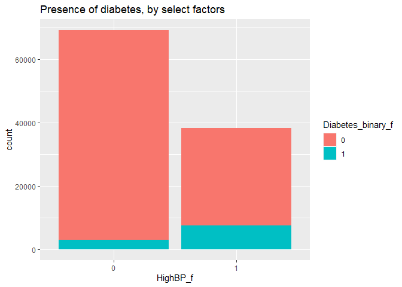

    explore(by_var = HighChol_f)

    ## # A tibble: 2 × 2
    ##   HighChol_f diabetes_rate
    ##   <fct>              <dbl>
    ## 1 0                 0.0551
    ## 2 1                 0.162

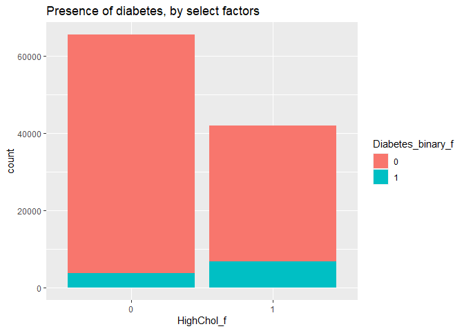

    explore(by_var = CholCheck_f)

    ## # A tibble: 2 × 2
    ##   CholCheck_f diabetes_rate
    ##   <fct>               <dbl>
    ## 1 0                  0.0129
    ## 2 1                  0.100

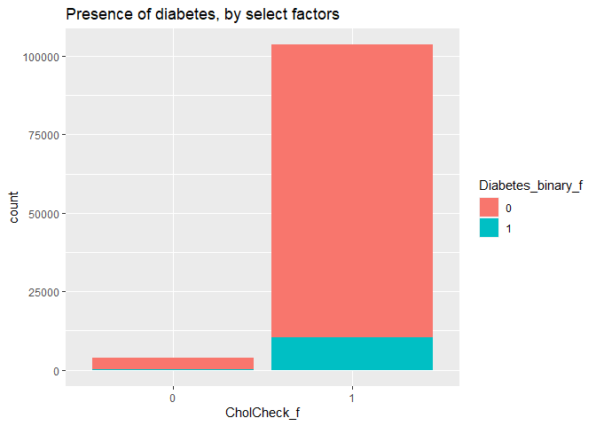

    explore(by_var = Smoker_f)

    ## # A tibble: 2 × 2
    ##   Smoker_f diabetes_rate
    ##   <fct>            <dbl>
    ## 1 0               0.0829
    ## 2 1               0.124

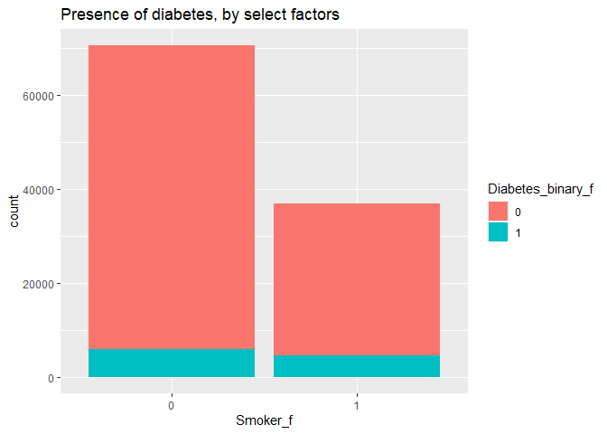

    explore(by_var = Stroke_f)

    ## # A tibble: 2 × 2
    ##   Stroke_f diabetes_rate
    ##   <fct>            <dbl>
    ## 1 0               0.0922
    ## 2 1               0.271

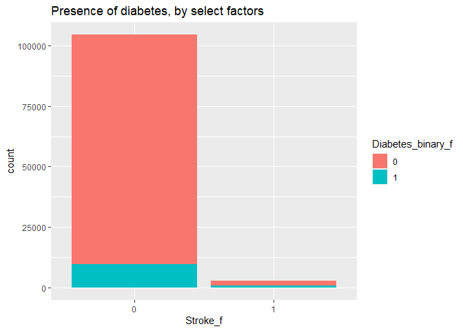

    explore(by_var = HeartDiseaseorAttack_f)

    ## # A tibble: 2 × 2
    ##   HeartDiseaseorAttack_f diabetes_rate
    ##   <fct>                          <dbl>
    ## 1 0                             0.0837
    ## 2 1                             0.283

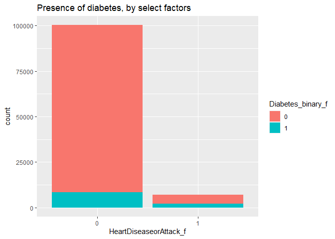

    explore(by_var = PhysActivity_f)

    ## # A tibble: 2 × 2
    ##   PhysActivity_f diabetes_rate
    ##   <fct>                  <dbl>
    ## 1 0                     0.171 
    ## 2 1                     0.0833

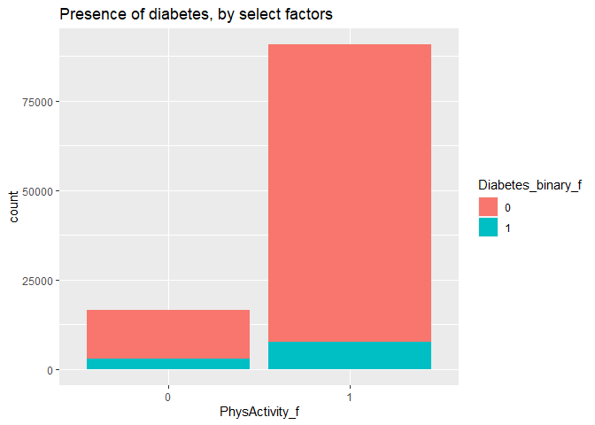

    explore(by_var = Fruits_f)

    ## # A tibble: 2 × 2
    ##   Fruits_f diabetes_rate
    ##   <fct>            <dbl>
    ## 1 0               0.114 
    ## 2 1               0.0892

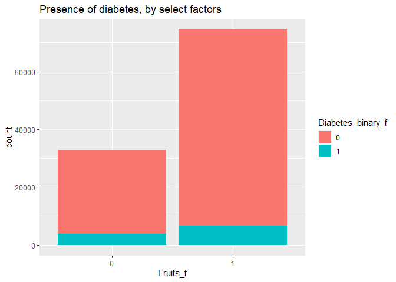

    explore(by_var = Veggies_f)

    ## # A tibble: 2 × 2
    ##   Veggies_f diabetes_rate
    ##   <fct>             <dbl>
    ## 1 0                0.129 
    ## 2 1                0.0921

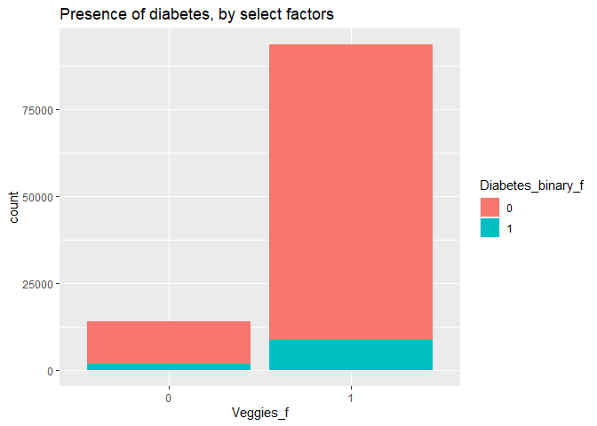

    explore(by_var = HvyAlcoholConsump_f)

    ## # A tibble: 2 × 2
    ##   HvyAlcoholConsump_f diabetes_rate
    ##   <fct>                       <dbl>
    ## 1 0                          0.100 
    ## 2 1                          0.0423

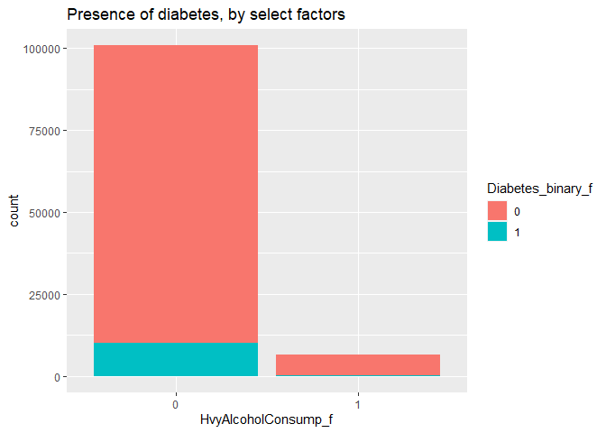

    explore(by_var = AnyHealthcare_f)

    ## # A tibble: 2 × 2
    ##   AnyHealthcare_f diabetes_rate
    ##   <fct>                   <dbl>
    ## 1 0                      0.0840
    ## 2 1                      0.0972

    explore(by_var = NoDocbcCost_f)

    ## # A tibble: 2 × 2
    ##   NoDocbcCost_f diabetes_rate
    ##   <fct>                 <dbl>
    ## 1 0                    0.0951
    ## 2 1                    0.128

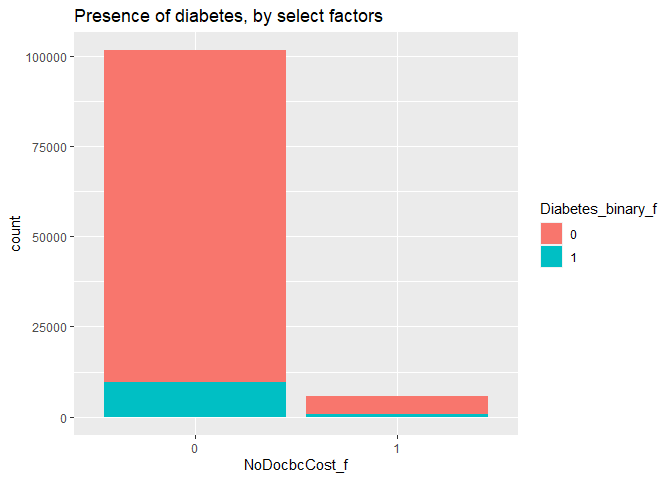

    explore(by_var = GenHlth_f)

    ## # A tibble: 5 × 2
    ##   GenHlth_f diabetes_rate
    ##   <fct>             <dbl>
    ## 1 1                0.0175
    ## 2 2                0.0595
    ## 3 3                0.160 
    ## 4 4                0.289 
    ## 5 5                0.370

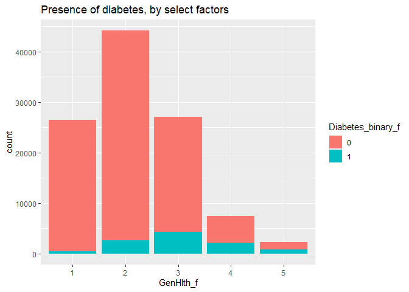

    explore(by_var = DiffWalk_f)

    ## # A tibble: 2 × 2
    ##   DiffWalk_f diabetes_rate
    ##   <fct>              <dbl>
    ## 1 0                 0.0788
    ## 2 1                 0.268

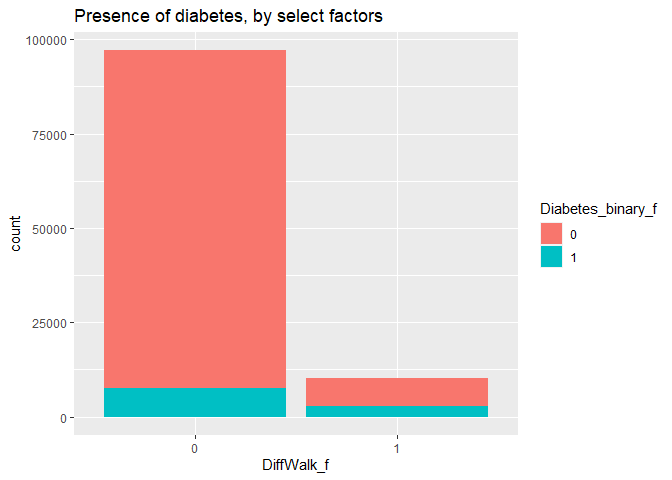

    explore(by_var = Sex_f)

    ## # A tibble: 2 × 2
    ##   Sex_f diabetes_rate
    ##   <fct>         <dbl>
    ## 1 0            0.0785
    ## 2 1            0.118

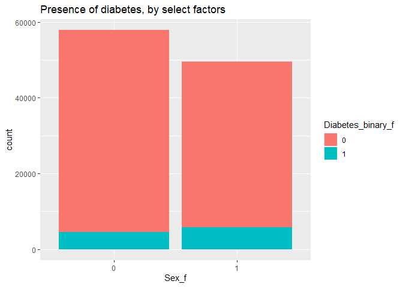

    explore(by_var = Age_f)

    ## # A tibble: 13 × 2
    ##    Age_f diabetes_rate
    ##    <fct>         <dbl>
    ##  1 1            0.0108
    ##  2 2            0.0105
    ##  3 3            0.0184
    ##  4 4            0.0254
    ##  5 5            0.0409
    ##  6 6            0.0511
    ##  7 7            0.0803
    ##  8 8            0.0911
    ##  9 9            0.123 
    ## 10 10           0.154 
    ## 11 11           0.172 
    ## 12 12           0.167 
    ## 13 13           0.150

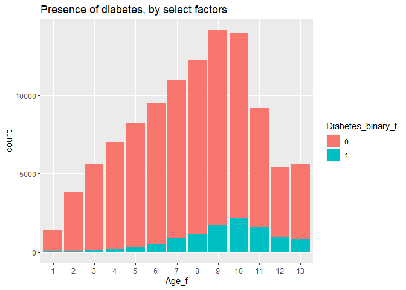

    explore(by_var = Income_f)

    ## # A tibble: 8 × 2
    ##   Income_f diabetes_rate
    ##   <fct>            <dbl>
    ## 1 1               0.168 
    ## 2 2               0.204 
    ## 3 3               0.185 
    ## 4 4               0.157 
    ## 5 5               0.151 
    ## 6 6               0.129 
    ## 7 7               0.106 
    ## 8 8               0.0698

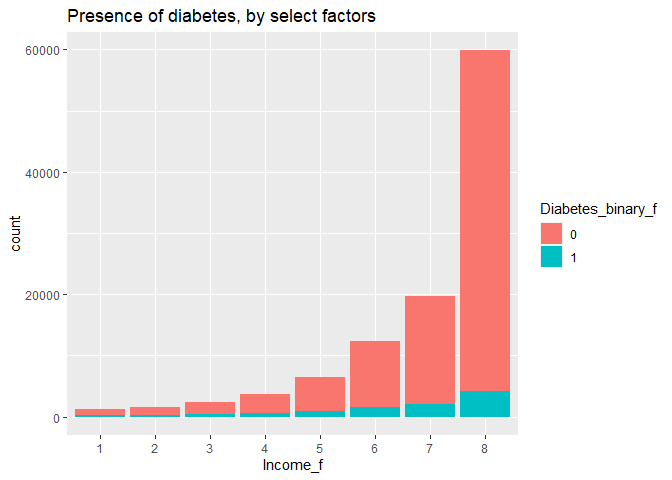

    #correlation matrix (outcome var x continuous vars)
    corr_vars <-
      temp %>% select(c(Diabetes_binary, BMI, MentHlth, PhysHlth))
    correlation <- cor(corr_vars, method = "spearman")
    corrplot(correlation, type = "upper", tl.pos = "lt")
    corrplot(correlation, type = "lower", method = "number", add = TRUE, diag = FALSE, tl.pos = "n")

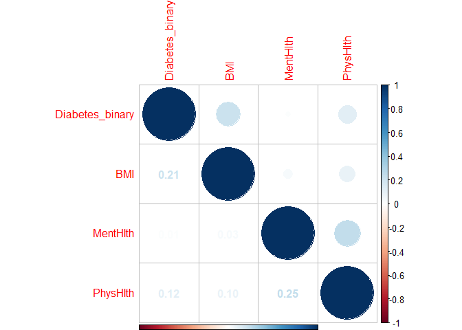

    #density plots / boxplots (outcome var x continuous vars)
    #I'm guessing we could just choose one or the other
    ggplot(data=temp, aes(x=BMI, fill=Diabetes_binary_f)) + 
      geom_density(adjust = 0.5, alpha = 0.5) +
      labs(title = "BMI, by diabetes status")

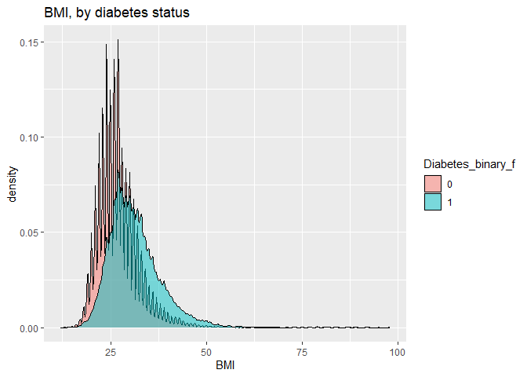

    ggplot(data=temp, aes(x=Diabetes_binary_f, y=BMI)) + geom_boxplot() +
      labs(title = "BMI, by diabetes status")

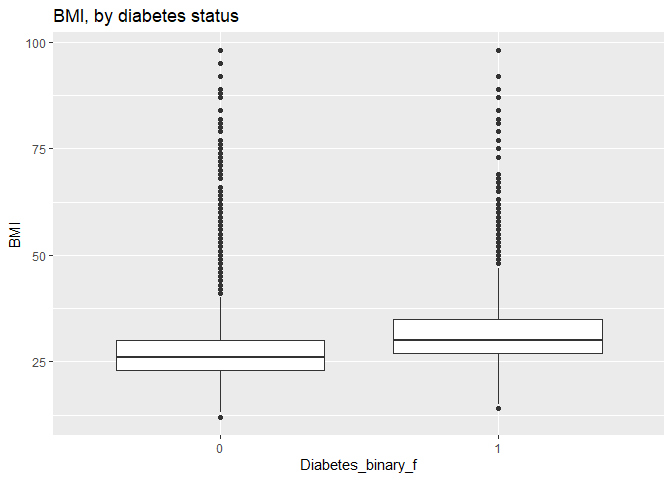

    ggplot(data=temp, aes(x=MentHlth, fill=Diabetes_binary_f)) + 
      geom_density(adjust = 0.5, alpha = 0.5) +
      labs(title = "Number of poor mental health days, by diabetes status")

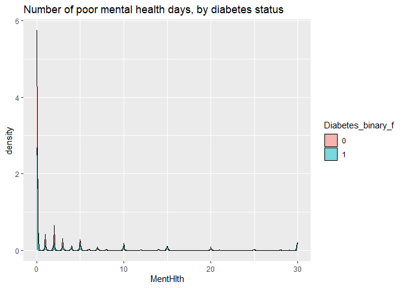

    ggplot(data=temp, aes(x=Diabetes_binary_f, y=MentHlth)) + geom_boxplot() +
      labs(title = "Number of poor mental health days, by diabetes status")

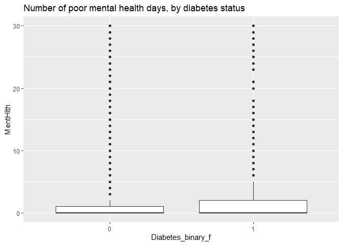

    ggplot(data=temp, aes(x=PhysHlth, fill=Diabetes_binary_f)) + 
      geom_density(adjust = 0.5, alpha = 0.5) +
      labs(title = "Number of poor physical health days, by diabetes status")

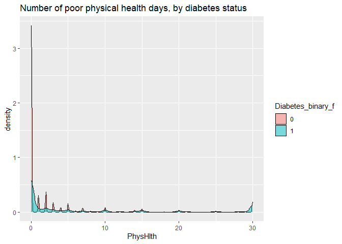

    bp3 <- ggplot(data=temp, aes(x=Diabetes_binary_f, y=PhysHlth)) + 
      geom_boxplot() + 
      labs(title = "Number of poor physical health days, by diabetes status")

# Modeling

We did some data cleaning and split the data into a training (70% of the
data) and test set (30% of the data). Use set.seed() to make things
reproducible. Then we will fit different models using different approach
and provide explanations.

## Data cleaning

We made a data cleaning so that the model fitting methods would work
better.

    #prior to running models, in instances where we have both a factor and a non-factor version of a given variable, we need to first drop the non-factor version of the variable
    #we also need to drop both versions of the education variable (since it will not vary given that we've subset our data to a specific education level)
    temp$Diabetes_binary     <- NULL 
    temp$HighBP  <- NULL
    temp$HighChol    <- NULL
    temp$CholCheck   <- NULL
    temp$Smoker  <- NULL
    temp$Stroke  <- NULL
    temp$HeartDiseaseorAttack    <- NULL
    temp$PhysActivity    <- NULL
    temp$Fruits  <- NULL
    temp$Veggies     <- NULL
    temp$HvyAlcoholConsump   <- NULL
    temp$AnyHealthcare   <- NULL
    temp$NoDocbcCost     <- NULL 
    temp$GenHlth <-  NULL
    temp$DiffWalk    <- NULL
    temp$Sex     <- NULL
    temp$Age     <- NULL
    temp$Education   <- NULL
    temp$Education_f     <- NULL
    temp$Income  <- NULL

    # convert the 0 and 1 to no and yes for logLoss metric to work.
    temp$Diabetes_binary_f<-ifelse(temp$Diabetes_binary_f==0,"no","yes")
    temp$Diabetes_binary_f<-as.factor(temp$Diabetes_binary_f)

## train and test set split

    # set the seed
    set.seed(433)
    # split the training and testing
    indextrain<-createDataPartition(y=temp$Diabetes_binary,p=0.7,list=FALSE)
    ed_train<-temp[indextrain,]
    ed_test<-temp[-indextrain,]

The goal is to create models for predicting the Diabetes\_binary
variable (using caret). We’ll use logLoss as our metric to evaluate
models. For all model types use logLoss with 5 fold cross-validation to
select the best model.

## what log loss is:

Log loss is a common evaluation metric for binary classification models.
It measure the performance of a model by quantifying the difference
between predicted probabilities and actual values. The more the
predicted probability diverges from the actual value, the higher is the
log-loss value.A lower log loss value means better
predictions.Mathematically, log loss is the negative average of the log
of correct predicted probabilities for each instance.

We prefer it because log loss penalizes confident and incorrect
predictors more heavily. It also provides a continuous and
differentiable meausre of the model’s performance, making it suitable of
optimization algorithms. It could be interpreted as the logarithmic
measure of the likelihood of the predicted probabilities aligning with
the true labels.

### related links

Here are two website links I found useful for explaining this term:

<https://www.analyticsvidhya.com/blog/2020/11/binary-cross-entropy-aka-log-loss-the-cost-function-used-in-logistic-regression/>

<https://towardsdatascience.com/intuition-behind-log-loss-score-4e0c9979680a>

## First method: logistic regression

### explanation of what a logistic regression is

The logistic regression is modeling average number of successes for a
given x, i.e. probability of success.Basic logistic regression models
success probability using the logistic function
$P(success|yard)=\frac{e^{\beta\_0+\beta\_1x}}{1+e^{\beta\_0+\beta\_1x}}$

### why we apply it to this kind of data

We have a response variable that is success/failure and it is perfect
for fitting a logistic regression mode.

### fit three candidate logistic regression models and choose the best model.

    ed_logistic1<-train(Diabetes_binary_f~BMI+HighChol_f+HighBP_f,data=ed_train,
                 method="glm", 
                 metric="logLoss",
                 trControl=trainControl(method = "cv",number = 5,classProbs = TRUE, summaryFunction = mnLogLoss),
                 preProcess=c("center","scale")
    )
    ed_logistic1

    ## Generalized Linear Model 
    ## 
    ## 75128 samples
    ##     3 predictor
    ##     2 classes: 'no', 'yes' 
    ## 
    ## Pre-processing: centered (3), scaled (3) 
    ## Resampling: Cross-Validated (5 fold) 
    ## Summary of sample sizes: 60103, 60102, 60102, 60102, 60103 
    ## Resampling results:
    ## 
    ##   logLoss  
    ##   0.2733522

    ed_logistic2<-train(Diabetes_binary_f~BMI+HighChol_f+HighBP_f+MentHlth+PhysActivity_f,data=ed_train,
                 method="glm", 
                 metric="logLoss",
                 trControl=trainControl(method = "cv",number = 5,classProbs = TRUE, summaryFunction = mnLogLoss),
                 preProcess=c("center","scale")
    )
    ed_logistic2

    ## Generalized Linear Model 
    ## 
    ## 75128 samples
    ##     5 predictor
    ##     2 classes: 'no', 'yes' 
    ## 
    ## Pre-processing: centered (5), scaled (5) 
    ## Resampling: Cross-Validated (5 fold) 
    ## Summary of sample sizes: 60102, 60103, 60103, 60102, 60102 
    ## Resampling results:
    ## 
    ##   logLoss 
    ##   0.271871

    ed_logistic3<-train(Diabetes_binary_f~.,data=ed_train,
                 method="glm", 
                 metric="logLoss",
                 trControl=trainControl(method = "cv",number = 5,classProbs = TRUE, summaryFunction = mnLogLoss),
                 preProcess=c("center","scale")
    )
    ed_logistic3

    ## Generalized Linear Model 
    ## 
    ## 75128 samples
    ##    20 predictor
    ##     2 classes: 'no', 'yes' 
    ## 
    ## Pre-processing: centered (40), scaled (40) 
    ## Resampling: Cross-Validated (5 fold) 
    ## Summary of sample sizes: 60102, 60103, 60103, 60102, 60102 
    ## Resampling results:
    ## 
    ##   logLoss  
    ##   0.2456893

    # return the result
    paste0("According to the results, the lowest logLoss is the model ", c("1","2","3")[which.min(c(ed_logistic1$results[2],ed_logistic2$results[2],ed_logistic3$results[2]))])

    ## [1] "According to the results, the lowest logLoss is the model 3"

## Second method: Lasso logistic

Lasso models aim to leverage the bias-variance trade-off by purposefully
introducing small amounts of bias while training the model, with the
hope of ultimately decreasing variance (and thereby improving
performance when using the model on test data). Instead of minimizing
the residual sum of squares, the lasso method attempts to minimize the
residual sum of squares *plus a so-called “shrinkage penalty”*. In
effect, the shrinkage penalty constrains regression coefficients, and in
so doing, allows the model to better generalize to test data. Here we
use cross-validation to test different values for the shrinkage penalty
in hopes of determining its optimal value, i.e. the shinkage penalty
value which eliminates the greatest amount of variance in exchange for
introduction of the smallest amount of bias.

    ed_lasso <- train(Diabetes_binary_f ~ ., data = ed_train,
      method = "glmnet",
      metric="logLoss",
      preProcess = c("center", "scale"),
      trControl = trainControl(method = "cv", number = 5, 
                               classProbs = TRUE, summaryFunction = mnLogLoss),
      tuneGrid = expand.grid(alpha = 1, lambda = seq(0, 1, by = 0.1)))

    ed_lasso

    ## glmnet 
    ## 
    ## 75128 samples
    ##    20 predictor
    ##     2 classes: 'no', 'yes' 
    ## 
    ## Pre-processing: centered (40), scaled (40) 
    ## Resampling: Cross-Validated (5 fold) 
    ## Summary of sample sizes: 60102, 60103, 60102, 60102, 60103 
    ## Resampling results across tuning parameters:
    ## 
    ##   lambda  logLoss  
    ##   0.0     0.2457484
    ##   0.1     0.3182206
    ##   0.2     0.3182206
    ##   0.3     0.3182206
    ##   0.4     0.3182206
    ##   0.5     0.3182206
    ##   0.6     0.3182206
    ##   0.7     0.3182206
    ##   0.8     0.3182206
    ##   0.9     0.3182206
    ##   1.0     0.3182206
    ## 
    ## Tuning parameter 'alpha' was held constant at a value of 1
    ## logLoss was used to select the optimal model using the smallest value.
    ## The final values used for the model were alpha = 1 and lambda = 0.

## Third method: Classification tree

Next we predict the presence of diabetes using a classification tree, in
which the predictor space is divided into various “regions”, and the
predicted value for any given observation is the most common
classification among all other observations in that region.
Classification trees are advantageous in that they are relatively easy
to understand, and that they automatically account for interaction
effects. Here we train our model using 5-fold cross-validation as well
as different tuning parameters to find the optimal number and types of
tree splits.

    #classification tree
    ed_ct <- train(Diabetes_binary_f ~ ., data = ed_train,
      method = "rpart",
      metric="logLoss",
      preProcess = c("center", "scale"),
      trControl = trainControl(method = "cv", number = 5, 
                               classProbs = TRUE, summaryFunction = mnLogLoss),
      tuneGrid = data.frame(cp = seq(from = .001, to = .1, by = .001)))

    ed_ct

    ## CART 
    ## 
    ## 75128 samples
    ##    20 predictor
    ##     2 classes: 'no', 'yes' 
    ## 
    ## Pre-processing: centered (40), scaled (40) 
    ## Resampling: Cross-Validated (5 fold) 
    ## Summary of sample sizes: 60102, 60102, 60103, 60103, 60102 
    ## Resampling results across tuning parameters:
    ## 
    ##   cp     logLoss  
    ##   0.001  0.2793891
    ##   0.002  0.2795659
    ##   0.003  0.3031021
    ##   0.004  0.3182206
    ##   0.005  0.3182206
    ##   0.006  0.3182206
    ##   0.007  0.3182206
    ##   0.008  0.3182206
    ##   0.009  0.3182206
    ##   0.010  0.3182206
    ##   0.011  0.3182206
    ##   0.012  0.3182206
    ##   0.013  0.3182206
    ##   0.014  0.3182206
    ##   0.015  0.3182206
    ##   0.016  0.3182206
    ##   0.017  0.3182206
    ##   0.018  0.3182206
    ##   0.019  0.3182206
    ##   0.020  0.3182206
    ##   0.021  0.3182206
    ##   0.022  0.3182206
    ##   0.023  0.3182206
    ##   0.024  0.3182206
    ##   0.025  0.3182206
    ##   0.026  0.3182206
    ##   0.027  0.3182206
    ##   0.028  0.3182206
    ##   0.029  0.3182206
    ##   0.030  0.3182206
    ##   0.031  0.3182206
    ##   0.032  0.3182206
    ##   0.033  0.3182206
    ##   0.034  0.3182206
    ##   0.035  0.3182206
    ##   0.036  0.3182206
    ##   0.037  0.3182206
    ##   0.038  0.3182206
    ##   0.039  0.3182206
    ##   0.040  0.3182206
    ##   0.041  0.3182206
    ##   0.042  0.3182206
    ##   0.043  0.3182206
    ##   0.044  0.3182206
    ##   0.045  0.3182206
    ##   0.046  0.3182206
    ##   0.047  0.3182206
    ##   0.048  0.3182206
    ##   0.049  0.3182206
    ##   0.050  0.3182206
    ##   0.051  0.3182206
    ##   0.052  0.3182206
    ##   0.053  0.3182206
    ##   0.054  0.3182206
    ##   0.055  0.3182206
    ##   0.056  0.3182206
    ##   0.057  0.3182206
    ##   0.058  0.3182206
    ##   0.059  0.3182206
    ##   0.060  0.3182206
    ##   0.061  0.3182206
    ##   0.062  0.3182206
    ##   0.063  0.3182206
    ##   0.064  0.3182206
    ##   0.065  0.3182206
    ##   0.066  0.3182206
    ##   0.067  0.3182206
    ##   0.068  0.3182206
    ##   0.069  0.3182206
    ##   0.070  0.3182206
    ##   0.071  0.3182206
    ##   0.072  0.3182206
    ##   0.073  0.3182206
    ##   0.074  0.3182206
    ##   0.075  0.3182206
    ##   0.076  0.3182206
    ##   0.077  0.3182206
    ##   0.078  0.3182206
    ##   0.079  0.3182206
    ##   0.080  0.3182206
    ##   0.081  0.3182206
    ##   0.082  0.3182206
    ##   0.083  0.3182206
    ##   0.084  0.3182206
    ##   0.085  0.3182206
    ##   0.086  0.3182206
    ##   0.087  0.3182206
    ##   0.088  0.3182206
    ##   0.089  0.3182206
    ##   0.090  0.3182206
    ##   0.091  0.3182206
    ##   0.092  0.3182206
    ##   0.093  0.3182206
    ##   0.094  0.3182206
    ##   0.095  0.3182206
    ##   0.096  0.3182206
    ##   0.097  0.3182206
    ##   0.098  0.3182206
    ##   0.099  0.3182206
    ##   0.100  0.3182206
    ## 
    ## logLoss was used to select the optimal model using the smallest value.
    ## The final value used for the model was cp = 0.001.

## Fourth method: Random forest

### Explanation of the random forest:

The random forest uses the same idea as bagging. It creates multiple
trees from bootstrap samples and averages results. It uses a random
subset of predictors for each bootstrap sample fit.

### why we might use it instead of a basic classification tree:

We want to use random forest because we do not want to use all the
predictors.If a really strong predictor exists, every bootstrap tree
will probably use it for the first split and it will make the prediction
more correlated.

    ed_rf<-train(Diabetes_binary_f~.,#BMI+HighBP_f+HighChol_f
                 data=ed_train,
                 method="rf", 
                 metric="logLoss",
                 trControl=trainControl(method = "cv",number = 5, classProbs=TRUE, summaryFunction=mnLogLoss),
                 preProcess=c("center","scale"),
                 tuneGrid=data.frame(mtry=c(5:7))
    )
    ed_rf

## Fifth method: rotation forest method

The rotation forest method is similar to the random forest method in
that multiple models are brought to bear – each having different numbers
and combinations of predictors – and the resulting set of predicted
values are then averaged across models (or, in the case of a categorical
outcome, the most prevalent classification across models is determined).
Unlike the random forest method, however, the rotation forest method
first extracts principal components from the various sets of predictor
variables that are considered, and enters the principal components as
predictors (as opposed to directly entering the original predictor
variables as is done when using random forest). In more general terms,
the rotation forest method is essentially a twist on the random forest
method whereby principal component regression (or, principal component
classification) is employed. As such, the rotation forest method is
particularly well-suited for dealing with any multi-collinearity that
may exist among the predictors. When training our model, we will use the
default number of variable subsets (i.e. the number of subsets that
results in 3 features per subset), and the default number of base
classifiers (i.e. 10).

    ed_rot <- train(Diabetes_binary_f ~ ., data = ed_train,
      method = "rotationForest",
      metric="logLoss",
      preProcess = c("center", "scale"),
      trControl = trainControl(method = "cv", number = 5, 
                               classProbs = TRUE, summaryFunction = mnLogLoss))

    ed_rot

    ## Rotation Forest 
    ## 
    ## 75128 samples
    ##    20 predictor
    ##     2 classes: 'no', 'yes' 
    ## 
    ## Pre-processing: centered (40), scaled (40) 
    ## Resampling: Cross-Validated (5 fold) 
    ## Summary of sample sizes: 60102, 60103, 60102, 60102, 60103 
    ## Resampling results across tuning parameters:
    ## 
    ##   K  L  logLoss  
    ##   1  3  0.3182206
    ##   1  6  0.3182206
    ##   1  9  0.3182206
    ##   2  3  0.3182206
    ##   2  6  0.3182206
    ##   2  9  0.3182206
    ##   4  3  0.3182206
    ##   4  6  0.3182206
    ##   4  9  0.3182206
    ## 
    ## logLoss was used to select the optimal model using the smallest value.
    ## The final values used for the model were K = 1 and L = 3.

## Sixth method: Bayesian Generalized Linear Model

The generalized linear model (GLM) is an approach incorporating various
probability distributions into a fitting procedure to describe
variability. A GLM with Bayesian inference is often used to avoid over
fitting. A Bayesian GLM can flexibly integrate various probability
distributions as model residuals and parameter uncertainty.

    ed_bglm<-train(Diabetes_binary_f~.,data=ed_train,
                 method="bayesglm", 
                 metric="logLoss",
                 trControl=trainControl(method = "cv",number = 5, classProbs=TRUE, summaryFunction=mnLogLoss),
                 preProcess=c("center","scale")
    )
    ed_bglm

    ## Bayesian Generalized Linear Model 
    ## 
    ## 75128 samples
    ##    20 predictor
    ##     2 classes: 'no', 'yes' 
    ## 
    ## Pre-processing: centered (40), scaled (40) 
    ## Resampling: Cross-Validated (5 fold) 
    ## Summary of sample sizes: 60103, 60103, 60102, 60102, 60102 
    ## Resampling results:
    ## 
    ##   logLoss  
    ##   0.2455926

# Final Model Selection

Lastly, we generate a log loss statistic for each of the six
models/methods above by applying each one to our test data; after doing
so, we identify a “best” model as the one with lowest log loss
statistic.

    # set a function to output logLoss value from each model by the test set
    choose <- function(in_model)
    {
    pred <- predict(in_model, ed_test) #logLoss() requires a vector
    pred <- ifelse(pred=="no",0,1) # it has to be numerical

    logLoss(actual = ed_test$Diabetes_binary_f, predicted = pred)
    }

    # make the variable numerical to work in logLoss function
    ed_test$Diabetes_binary_f<-ifelse(ed_test$Diabetes_binary_f=="no",0,1)

    # Method 1
    # only output the best from method 1
    a<-c("1","2","3")[which.min(c(ed_logistic1$results[2],ed_logistic2$results[2],ed_logistic3$results[2]))]
    ifelse(a!=3,
           ifelse(a==1,
                  CM1<-choose(in_model = ed_logistic1),
                  CM1<-choose(in_model = ed_logistic2)
                  ),
           CM1<-choose(in_model = ed_logistic3)
      )

    ## [1] 3.270769

    paste0("logistic has a logLoss of ",CM1)

    ## [1] "logistic has a logLoss of 3.27076948502421"

    # Method 2
    CM2<-choose(in_model = ed_lasso)
    paste0("lasso has a logLoss of ",CM2)

    ## [1] "lasso has a logLoss of 3.27506034152598"

    # Method 3
    CM3<-choose(in_model = ed_ct)
    paste0("classification tree has a logLoss of ",CM3)

    ## [1] "classification tree has a logLoss of 3.27398450445813"

    # Method 4
    #CM4<-choose(in_model = ed_rf)
    #paste0("random forests has a logLoss of ",CM4)

    # Method 5
    CM5<-choose(in_model = ed_rot)
    paste0("rotation forests has a logLoss of ",CM5)

    ## [1] "rotation forests has a logLoss of 3.34692618418242"

    # Method 6
    CM6<-choose(in_model = ed_bglm)
    paste0("glm has a logLoss of ",CM6)

    ## [1] "glm has a logLoss of 3.27184219294102"

## Final conclusion

The fit with the smallest logLoss value would be selected as the final
model.

    CM<-c(CM1,CM2,CM3,#CM4,
          CM5,CM6)
    paste0("model ",c("1","2","3",#"4",
                    "5","6")[which.min(CM)]," is the best model")

    ## [1] "model 1 is the best model"
