project3
================
Xiaomeng Liu
2023-11-05

- [library](#library)
- [Introduction section](#introduction-section)
- [Data](#data)
  - [Read in the data](#read-in-the-data)
  - [Combine 1 and 2 Education
    levels](#combine-1-and-2-education-levels)
  - [Convert variables to factors](#convert-variables-to-factors)
- [Summarizations](#summarizations)
- [Modeling](#modeling)
- [Final Model Selection](#final-model-selection)

# library

``` r
library(readr)
library(dplyr)
library(ggplot2)
library(corrplot)
library(caret)
```

# Introduction section

``` r
  #per https://www.cdc.gov/brfss/annual_data/2015/pdf/codebook15_llcp.pdf,
  #here are value meanings for the education variable:
    #1 = Never attended school or only kindergarten 
    #2 = Grades 1 through 8 (Elementary)
    #3 = Grades 9 through 11 (Some high school)
    #4 = Grade 12 or GED (High school graduate) 
    #5 = College 1 year to 3 years (Some college or technical school)
    #6 = College 4 years or more (College graduate)
    #9 = Refused

#and here are values for other non-binary variables:
  #income
    #1 = Less than $10,000
    #2 = Less than $15,000 ($10,000 to less than $15,000)
    #3 = Less than $20,000 ($15,000 to less than $20,000)
    #4 = Less than $25,000 ($20,000 to less than $25,000)
    #5 = Less than $35,000 ($25,000 to less than $35,000)
    #6 = Less than $50,000 ($35,000 to less than $50,000)
    #7 = Less than $75,000 ($50,000 to less than $75,000)
    #8 = $75,000 or more
    #77 = Don’t know/Not sure
    #99 = Refused

  #Age
    #1 = Age 18 to 24
    #2 = Age 25 to 29
    #3 = Age 30 to 34
    #4 = Age 35 to 39
    #5 = Age 40 to 44
    #6 = Age 45 to 49
    #7 = Age 50 to 54
    #8 = Age 55 to 59
    #9 = Age 60 to 64
    #10 = Age 65 to 69
    #11 = Age 70 to 74
    #12 = Age 75 to 79
    #13 = Age 80 or older
    #14 = Don’t know/Refused/Missing

  #GenHlth
    #1 = excellent 
    #2 = very good 
    #3 = good 
    #4 = fair 
    #5 = poor 

  #Sex is coded as 0 = female, 1 = male
```

# Data

### Read in the data

``` r
#read in csv file
diabetes<-read.csv("C:\\Users\\elauf\\Desktop\\ST558\\topic3\\project3-2023-11-08\\diabetes_binary_health_indicators_BRFSS2015.csv")
```

### Combine 1 and 2 Education levels

``` r
#create collapsed version of education variable
diabetes$Education <- recode(diabetes$Education, `1` = 2)
table(diabetes$Education)
```

    ## 
    ##      2      3      4      5      6 
    ##   4217   9478  62750  69910 107325

### Convert variables to factors

``` r
#create factor version of variables, where applicable
#in order to facilitate the EDA, for now at least, we'll retain both the factor version and the numeric version of each variable (we may need to drop one version, though, before running models)
diabetes$Diabetes_binary_f   <- as.factor(diabetes$Diabetes_binary)
diabetes$HighBP_f    <- as.factor(diabetes$HighBP)
diabetes$HighChol_f  <- as.factor(diabetes$HighChol)
diabetes$CholCheck_f     <- as.factor(diabetes$CholCheck)
#BMI -- this is a continuous var
diabetes$Smoker_f    <- as.factor(diabetes$Smoker)
diabetes$Stroke_f    <- as.factor(diabetes$Stroke)
diabetes$HeartDiseaseorAttack_f  <- as.factor(diabetes$HeartDiseaseorAttack)
diabetes$PhysActivity_f  <- as.factor(diabetes$PhysActivity)
diabetes$Fruits_f    <- as.factor(diabetes$Fruits)
diabetes$Veggies_f   <- as.factor(diabetes$Veggies)
diabetes$HvyAlcoholConsump_f     <- as.factor(diabetes$HvyAlcoholConsump)
diabetes$AnyHealthcare_f     <- as.factor(diabetes$AnyHealthcare)
diabetes$NoDocbcCost_f   <- as.factor(diabetes$NoDocbcCost)
diabetes$GenHlth_f <-  as.factor(diabetes$GenHlth)
#MentHlth -- this is a continuous var
#PhysHlth -- this is a continuous var
diabetes$DiffWalk_f  <- as.factor(diabetes$DiffWalk)
diabetes$Sex_f   <- as.factor(diabetes$Sex)
diabetes$Age_f   <- as.factor(diabetes$Age)
diabetes$Education_f     <- as.factor(diabetes$Education)
diabetes$Income_f    <- as.factor(diabetes$Income)


#subset to specific level of education per *params* setting
temp <- subset(diabetes, Education==params$ed_level)
```

# Summarizations

``` r
#confirm that we're working with the desired set of cases
table(temp$Education, temp$Education_f)
```

    ##    
    ##         2     3     4     5     6
    ##   5     0     0     0 69910     0

``` r
ggplot(data=temp, aes(x=Education_f)) + 
  geom_dotplot(binwidth = .05, method = "histodot") + 
  labs(title = "confirm that we're working with the desired set of cases")
```

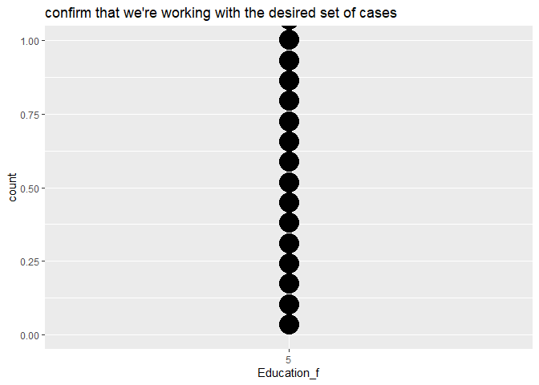<!-- -->

``` r
#function to check prevalence of diabetes at each level of each factor, and generate corresponding plots
#(I still need to flesh out this function such that it labels the plots)
explore <- function(by_var)
{
results1 <- temp %>%
  group_by({{by_var}}) %>%
  summarize(diabetes_rate = mean(Diabetes_binary))
    #passing variable names to function using curly brackets:
    #https://stackoverflow.com/questions/63433728/how-do-i-pass-a-variable-name-to-an-argument-in-a-function
print(results1)

results2 <- ggplot(data=temp, aes(x={{by_var}}, fill=Diabetes_binary_f)) + 
  geom_bar(stat="count")
print(results2)
}

#probably need to run the above function for at least the sex, age, and income variables, but may not need to run it for this entire list
explore(by_var = HighBP_f)
```

    ## # A tibble: 2 × 2
    ##   HighBP_f diabetes_rate
    ##   <fct>            <dbl>
    ## 1 0               0.0646
    ## 2 1               0.254

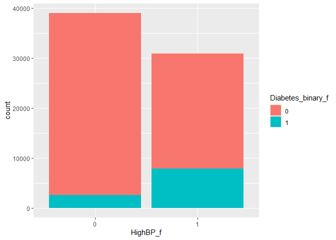<!-- -->

``` r
explore(by_var = HighChol_f)
```

    ## # A tibble: 2 × 2
    ##   HighChol_f diabetes_rate
    ##   <fct>              <dbl>
    ## 1 0                 0.0837
    ## 2 1                 0.235

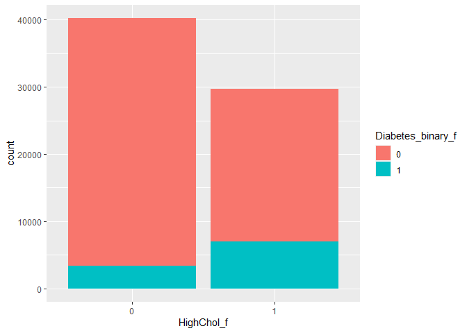<!-- -->

``` r
explore(by_var = CholCheck_f)
```

    ## # A tibble: 2 × 2
    ##   CholCheck_f diabetes_rate
    ##   <fct>               <dbl>
    ## 1 0                  0.0278
    ## 2 1                  0.153

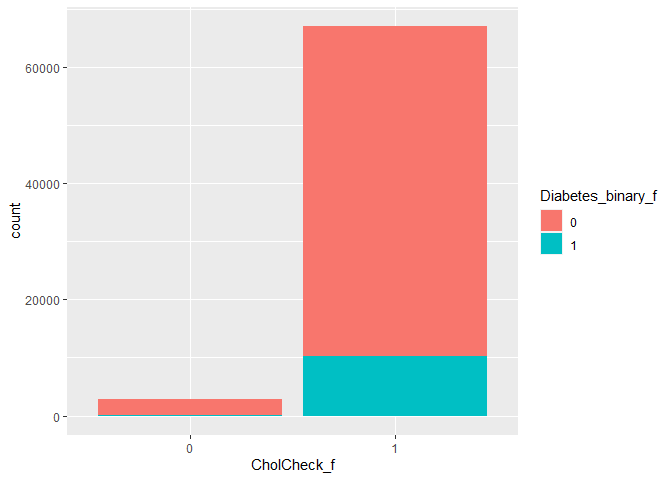<!-- -->

``` r
explore(by_var = Smoker_f)
```

    ## # A tibble: 2 × 2
    ##   Smoker_f diabetes_rate
    ##   <fct>            <dbl>
    ## 1 0                0.133
    ## 2 1                0.164

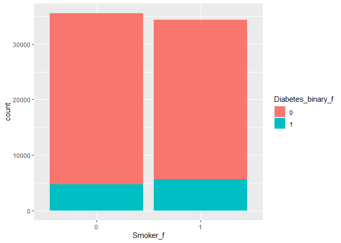<!-- -->

``` r
explore(by_var = Stroke_f)
```

    ## # A tibble: 2 × 2
    ##   Stroke_f diabetes_rate
    ##   <fct>            <dbl>
    ## 1 0                0.140
    ## 2 1                0.331

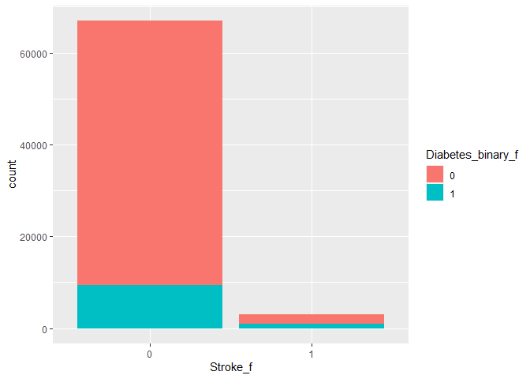<!-- -->

``` r
explore(by_var = HeartDiseaseorAttack_f)
```

    ## # A tibble: 2 × 2
    ##   HeartDiseaseorAttack_f diabetes_rate
    ##   <fct>                          <dbl>
    ## 1 0                              0.127
    ## 2 1                              0.342

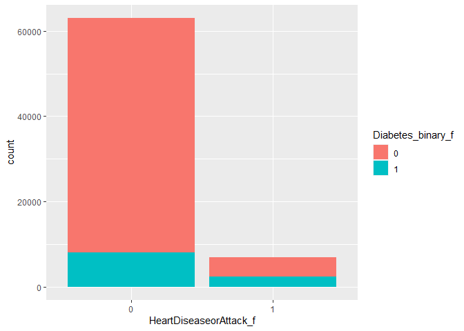<!-- -->

``` r
explore(by_var = PhysActivity_f)
```

    ## # A tibble: 2 × 2
    ##   PhysActivity_f diabetes_rate
    ##   <fct>                  <dbl>
    ## 1 0                      0.209
    ## 2 1                      0.127

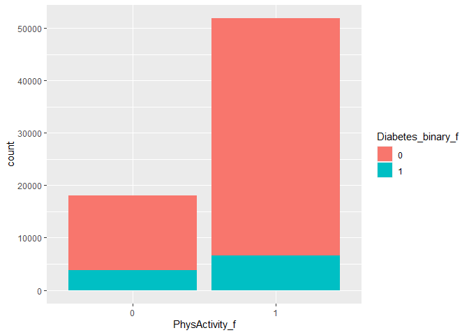<!-- -->

``` r
explore(by_var = Fruits_f)
```

    ## # A tibble: 2 × 2
    ##   Fruits_f diabetes_rate
    ##   <fct>            <dbl>
    ## 1 0                0.160
    ## 2 1                0.141

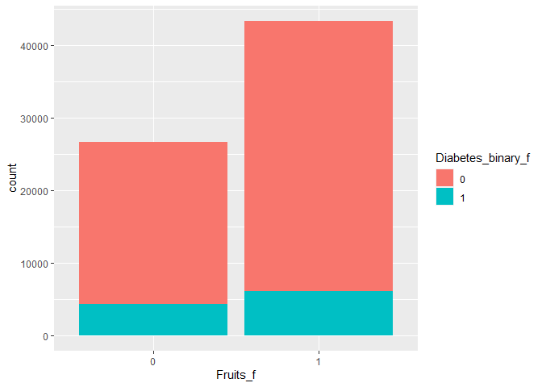<!-- -->

``` r
explore(by_var = Veggies_f)
```

    ## # A tibble: 2 × 2
    ##   Veggies_f diabetes_rate
    ##   <fct>             <dbl>
    ## 1 0                 0.177
    ## 2 1                 0.142

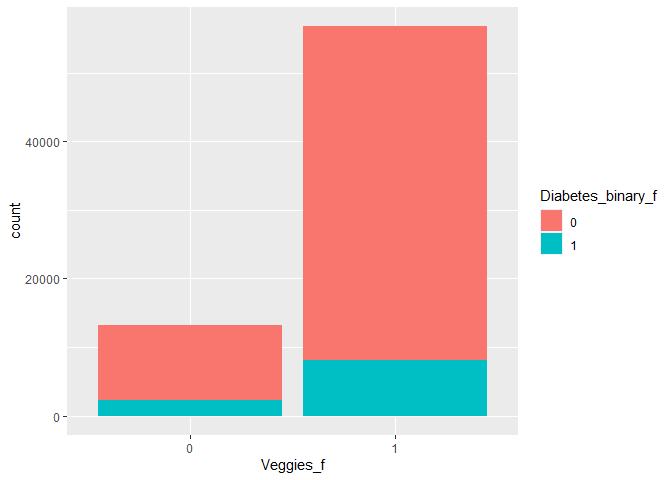<!-- -->

``` r
explore(by_var = HvyAlcoholConsump_f)
```

    ## # A tibble: 2 × 2
    ##   HvyAlcoholConsump_f diabetes_rate
    ##   <fct>                       <dbl>
    ## 1 0                          0.153 
    ## 2 1                          0.0650

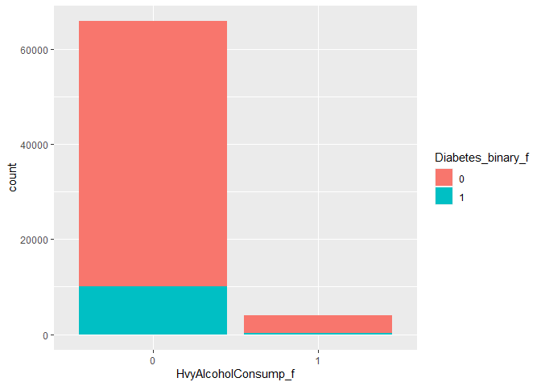<!-- -->

``` r
explore(by_var = AnyHealthcare_f)
```

    ## # A tibble: 2 × 2
    ##   AnyHealthcare_f diabetes_rate
    ##   <fct>                   <dbl>
    ## 1 0                       0.103
    ## 2 1                       0.151

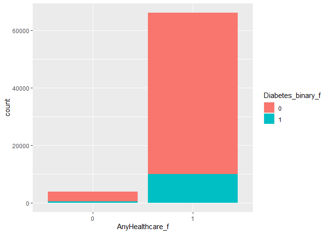<!-- -->

``` r
explore(by_var = NoDocbcCost_f)
```

    ## # A tibble: 2 × 2
    ##   NoDocbcCost_f diabetes_rate
    ##   <fct>                 <dbl>
    ## 1 0                     0.146
    ## 2 1                     0.170

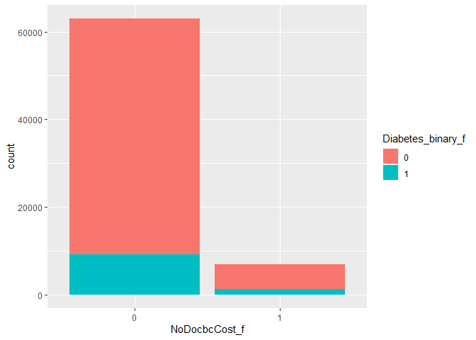<!-- -->

``` r
explore(by_var = GenHlth_f)
```

    ## # A tibble: 5 × 2
    ##   GenHlth_f diabetes_rate
    ##   <fct>             <dbl>
    ## 1 1                0.0296
    ## 2 2                0.0764
    ## 3 3                0.183 
    ## 4 4                0.310 
    ## 5 5                0.364

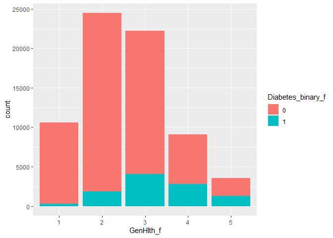<!-- -->

``` r
explore(by_var = DiffWalk_f)
```

    ## # A tibble: 2 × 2
    ##   DiffWalk_f diabetes_rate
    ##   <fct>              <dbl>
    ## 1 0                  0.112
    ## 2 1                  0.304

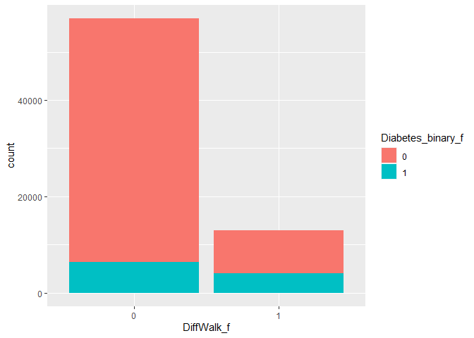<!-- -->

``` r
explore(by_var = Sex_f)
```

    ## # A tibble: 2 × 2
    ##   Sex_f diabetes_rate
    ##   <fct>         <dbl>
    ## 1 0             0.138
    ## 2 1             0.163

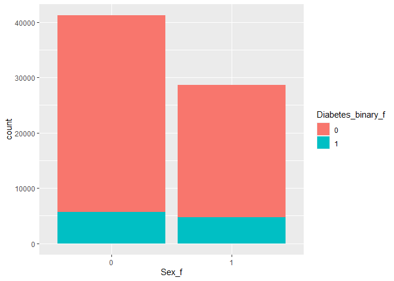<!-- -->

``` r
explore(by_var = Age_f)
```

    ## # A tibble: 13 × 2
    ##    Age_f diabetes_rate
    ##    <fct>         <dbl>
    ##  1 1            0.0104
    ##  2 2            0.0227
    ##  3 3            0.0309
    ##  4 4            0.0589
    ##  5 5            0.0807
    ##  6 6            0.101 
    ##  7 7            0.125 
    ##  8 8            0.150 
    ##  9 9            0.191 
    ## 10 10           0.221 
    ## 11 11           0.228 
    ## 12 12           0.214 
    ## 13 13           0.185

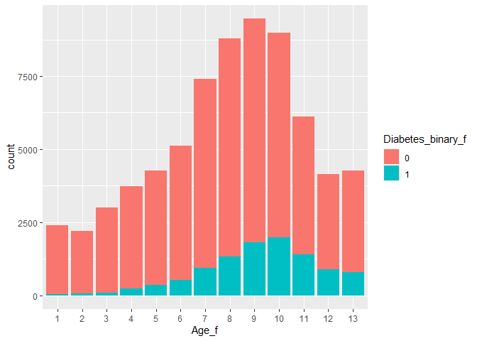<!-- -->

``` r
explore(by_var = Income_f)
```

    ## # A tibble: 8 × 2
    ##   Income_f diabetes_rate
    ##   <fct>            <dbl>
    ## 1 1               0.211 
    ## 2 2               0.241 
    ## 3 3               0.204 
    ## 4 4               0.194 
    ## 5 5               0.173 
    ## 6 6               0.146 
    ## 7 7               0.131 
    ## 8 8               0.0977

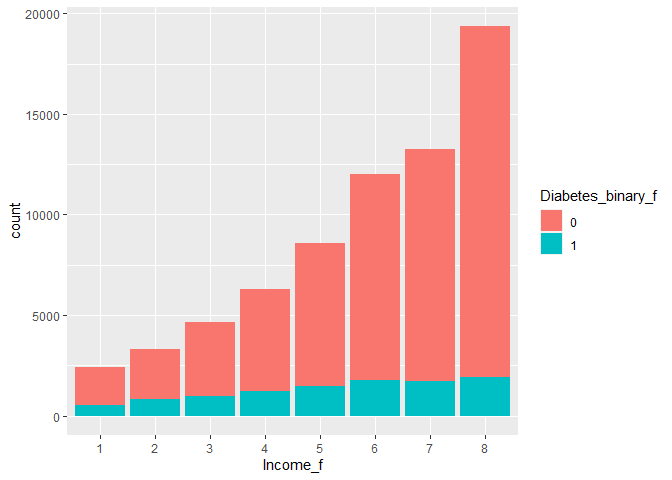<!-- -->

``` r
#correlation matrix (outcome var x continuous vars)
corr_vars <-
  temp %>% select(c(Diabetes_binary, BMI, MentHlth, PhysHlth))
correlation <- cor(corr_vars, method = "spearman")
corrplot(correlation, type = "upper", tl.pos = "lt")
corrplot(correlation, type = "lower", method = "number", add = TRUE, diag = FALSE, tl.pos = "n")
```

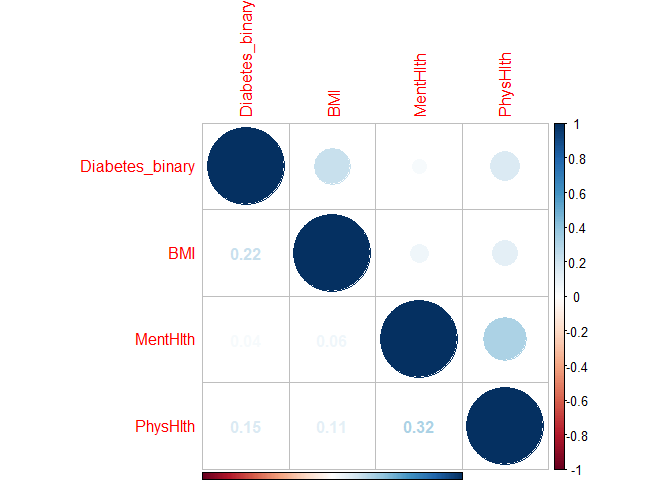<!-- -->

``` r
#density plots / boxplots (outcome var x continuous vars)
#I'm guessing we could just choose one or the other
ggplot(data=temp, aes(x=BMI, fill=Diabetes_binary_f)) + 
  geom_density(adjust = 0.5, alpha = 0.5)
```

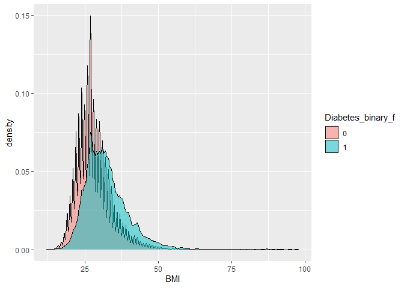<!-- -->

``` r
ggplot(data=temp, aes(x=Diabetes_binary_f, y=BMI)) + geom_boxplot()
```

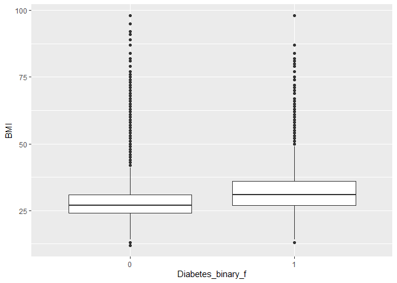<!-- -->

``` r
ggplot(data=temp, aes(x=MentHlth, fill=Diabetes_binary_f)) + 
  geom_density(adjust = 0.5, alpha = 0.5)
```

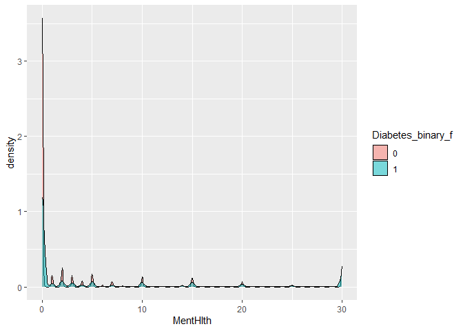<!-- -->

``` r
ggplot(data=temp, aes(x=Diabetes_binary_f, y=MentHlth)) + geom_boxplot()
```

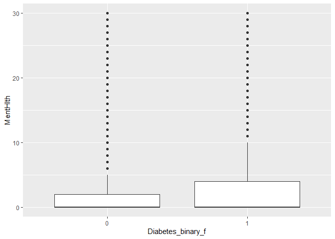<!-- -->

``` r
ggplot(data=temp, aes(x=PhysHlth, fill=Diabetes_binary_f)) + 
  geom_density(adjust = 0.5, alpha = 0.5)
```

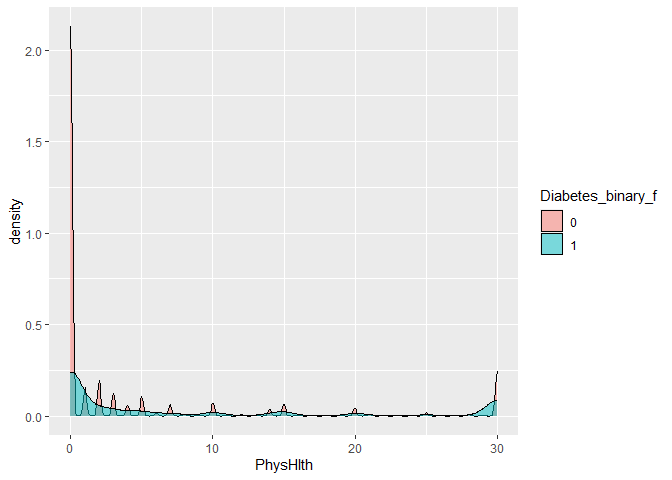<!-- -->

``` r
bp3 <- ggplot(data=temp, aes(x=Diabetes_binary_f, y=PhysHlth)) + geom_boxplot()
```

# Modeling

``` r
#prior to running models, in instances where we have both a factor and a non-factor version of a given variable, we need to first drop the non-factor version of the variable
#we also need to drop both versions of the education variable (since it will not vary given that we've subset our data to a specific education level)
temp$Diabetes_binary     <- NULL 
temp$HighBP  <- NULL
temp$HighChol    <- NULL
temp$CholCheck   <- NULL
temp$Smoker  <- NULL
temp$Stroke  <- NULL
temp$HeartDiseaseorAttack    <- NULL
temp$PhysActivity    <- NULL
temp$Fruits  <- NULL
temp$Veggies     <- NULL
temp$HvyAlcoholConsump   <- NULL
temp$AnyHealthcare   <- NULL
temp$NoDocbcCost     <- NULL 
temp$GenHlth <-  NULL
temp$DiffWalk    <- NULL
temp$Sex     <- NULL
temp$Age     <- NULL
temp$Education   <- NULL
temp$Education_f     <- NULL
temp$Income  <- NULL


# set the seed
set.seed(433)
# split the training and testing
indextrain<-createDataPartition(y=temp$Diabetes_binary,p=0.7,list=FALSE)
ed_train<-temp[indextrain,]
ed_test<-temp[-indextrain,]
```

#### what log loss is:

The first group member should research and write up a paragraph about
what log loss is and why we may prefer it to things like accuracy.

#### First method: logistic regression

The first group member should provide a reasonably thorough explanation
of what a logistic regression is and why we apply it to this kind of
data. Then they should fit three candidate logistic regression models
and choose the best model.

``` r
ed_logistic<-train(Diabetes_binary_f~.,data=temp,
             method="glm", 
             metric="logLoss",
             trControl=trainControl(method = "cv",number = 5),
             preProcess=c("center","scale")
)
```

    ## Warning in train.default(x, y, weights = w, ...): The metric "logLoss" was not in
    ## the result set. Accuracy will be used instead.

``` r
ed_logistic
```

    ## Generalized Linear Model 
    ## 
    ## 69910 samples
    ##    20 predictor
    ##     2 classes: '0', '1' 
    ## 
    ## Pre-processing: centered (40), scaled (40) 
    ## Resampling: Cross-Validated (5 fold) 
    ## Summary of sample sizes: 55928, 55928, 55929, 55927, 55928 
    ## Resampling results:
    ## 
    ##   Accuracy   Kappa    
    ##   0.8568303  0.1937541

#### Second method: Lasso logistic

Erich part

#### Third method: Classification tree

Erich part

#### Fourth method: Random forest

#### Fifth method:

new method by Erich

#### Sixth method:

new method by Xiaomeng

# Final Model Selection

You should now have six best models (one for each model type above)
